# Cairn

<p align="center">
  
  <br>
  <sub>The Brief → the whole-picture analysis → the connected brain → progress → recipes → coach chat &middot; made with fictional demo data</sub>
</p>

A self-hosted, connected, **day-reading wellness OS** for **training, nutrition & longevity** with
an agentic coaching loop and a memory that grows over time. It opens to a calm **Brief** that reads
your whole picture and *suggests* what kind of day today should be (a suggestion, never a gate),
propagates flagged lab findings across every domain they touch, runs adaptive nutrition, learns who
you are, captures effortlessly (frequents + voice + Apple Health), and surfaces quiet cross-domain
insights one at a time. The product north-star lives in [`docs/VISION.md`](docs/VISION.md). One Node
service serves:

- **PWA** (`/`) - phone app with six tabs: **Today** (the day-read **Brief** — a calm
  rest/easy/train suggestion with override chips and a "build me a session" launchpad; effortless
  capture via one-tap frequent foods, voice input, and an optional morning check-in; a quiet
  insight card; post-session 1-tap autoregulation feedback; plus the weekly stats strip,
  bodyweight quick-add, a date picker to log any past day, set-by-set logging with prefill + `N / M`
  progress, rest timer, PR detection, "+ Add exercise", finish-workout summary, form guides),
  **Plan** (a manual plan editor — add/remove/reorder days & exercises, per-exercise notes & warmup
  sets, plus the Coach draft/proposal/meal-plan flow with accept/discard UI), **Progress** (est-1RM
  trend, bodyweight chart vs goal, session history, volume by muscle, calendar heatmap, and an
  **Energy Balance** view with an adaptive nutrition check-in), **Chat** (talk to your coach: it logs
  safe things instantly and stages plan changes as drafts), **Me** (a Profile / Memory / Health /
  Life / **Family** sub-nav: profile with a free-text **about-me**, goal feasibility check &
  bodyweight, activity & food-notes logging; a **Memory** view to curate what the coach remembers;
  **Health** — upload bloodwork/DEXA/other as PDF or photo for marker extraction, plus a **Brain**
  view with recovery, optimal-zone priority markers, and the cross-domain directives propagated from
  your labs. Done/Dismiss on those directives becomes feedback memory: handled advice stays quiet
  for the same result, dismissed advice is not repeated unless the marker materially changes;
  **Life** — a timeline of trips, injuries & life events the coach plans around;
  **Family** — the roster the coach plans around), and **Settings** (agent rotation + weekly
  auto-coach, **agentic enrichment** toggle, **Apple Health** connect via an iOS Shortcut, data
  export/backup, first-run onboarding).
- **REST API** (`/api/*`).
- **MCP server** (`/mcp`, Streamable HTTP) - Claude / Codex / Antigravity / Grok read & write
  everything: plan, logs, profile, goal, activities, memory, meal plans, food notes, health
  records, and life-context events (trips/injuries).
- **Agent runner + scheduler** - drafts training-target and meal-plan proposals from your data.

Storage is SQLite via Node's built-in `node:sqlite`. **Requires Node 24** (where `node:sqlite`
is unflagged). The Docker image bundles Node 24, so users do not need Node installed on the host.

> [!IMPORTANT]
> **Security & where to run it.** Cairn ships with **no authentication by default** — it is a
> single-user app built for a network you already trust, **not the public internet**. Run it on your
> own machine, a home server, or a small VM. The simplest setup that is both private and reachable
> from your phone: put the host on a [Tailscale](https://tailscale.com) (or similar) network and open
> it by its **MagicDNS** name — no ports forwarded, no certificates to manage. **Never expose port
> `8787` to the open internet.** If any untrusted device can reach it, set `CAIRN_AUTH_TOKEN` to
> require a shared token, and serve it over HTTPS (Tailscale Serve / a private reverse proxy) so the
> PWA can install offline. See [`SECURITY.md`](SECURITY.md) and the deployment shapes below.

## Screens

<table>
<tr>
<td width="33%" valign="top">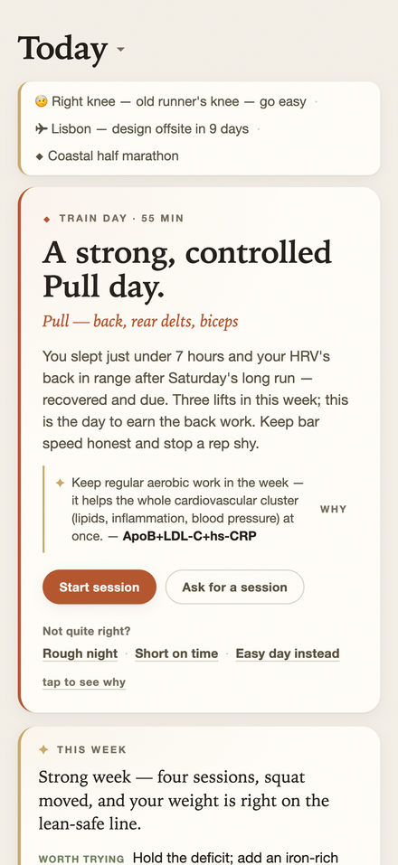<br><sub><b>The Brief.</b> Opens already having read your recovery and load — a calm rest/easy/train <i>suggestion</i> with one-tap overrides. Never a gate.</sub></td>
<td width="33%" valign="top">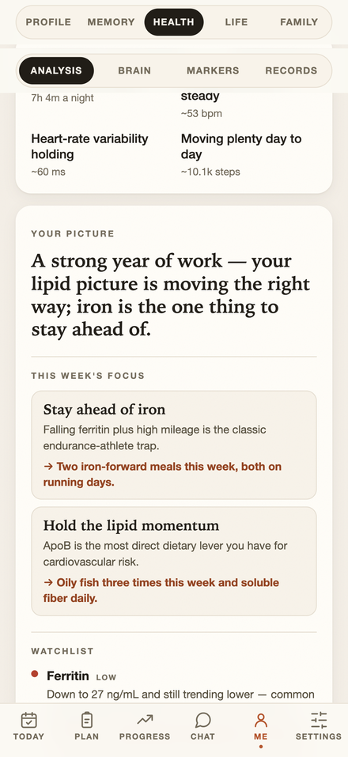<br><sub><b>The analysis.</b> The agentic brain's whole-picture read — what's going well, this week's focus with concrete actions, and what's out of order.</sub></td>
<td width="33%" valign="top">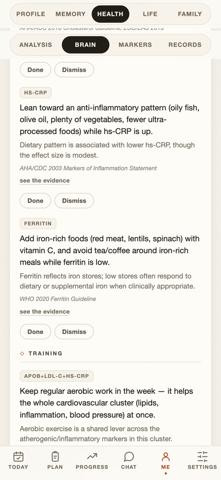<br><sub><b>Propagation.</b> A flagged lab becomes concrete nutrition / training / watch directives — each with its plain-language why and a citation.</sub></td>
</tr>
<tr>
<td valign="top">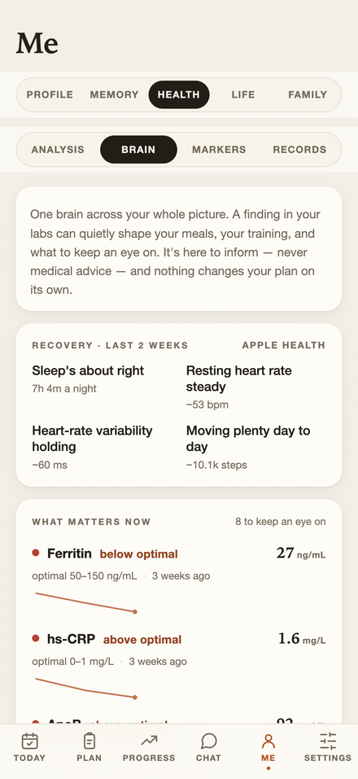<br><sub><b>The connected brain.</b> Recovery in plain language (no scores) and the markers worth watching, framed against the <i>optimal</i> range.</sub></td>
<td valign="top">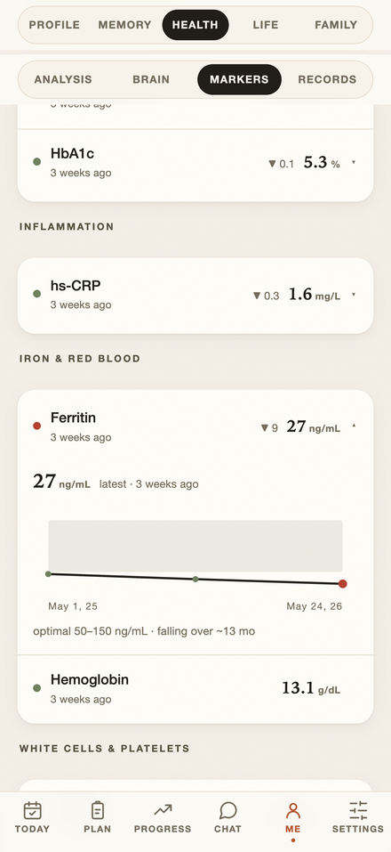<br><sub><b>Optimal-zone trends.</b> Each marker plotted against the longevity band — not just the lab's reference range — with the trend in words.</sub></td>
<td valign="top">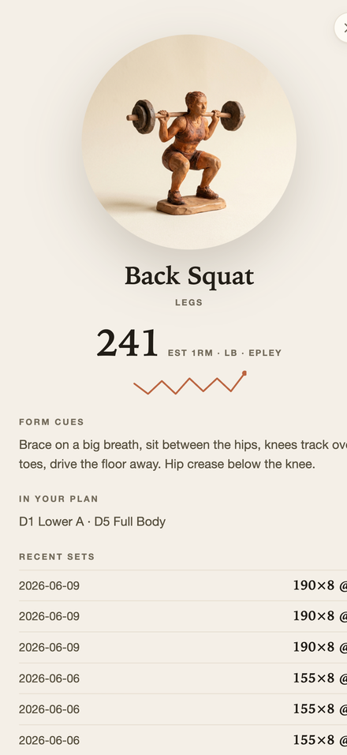<br><sub><b>Every exercise, illustrated.</b> Tap any lift for its est-1RM trend, form cues and history — with a generated studio illustration.</sub></td>
</tr>
<tr>
<td valign="top">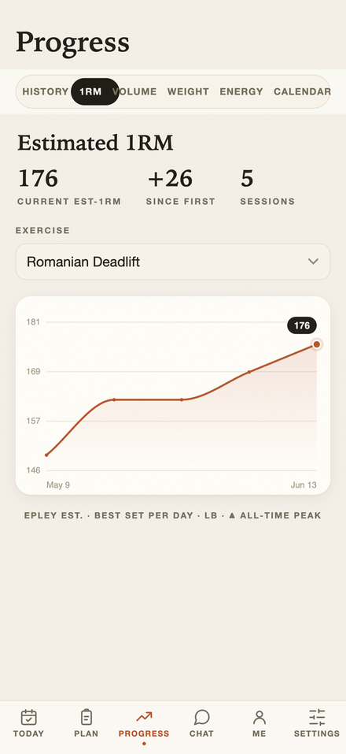<br><sub><b>Strength.</b> Est-1RM trend per lift, plus history, volume-by-muscle and a calendar heatmap.</sub></td>
<td valign="top">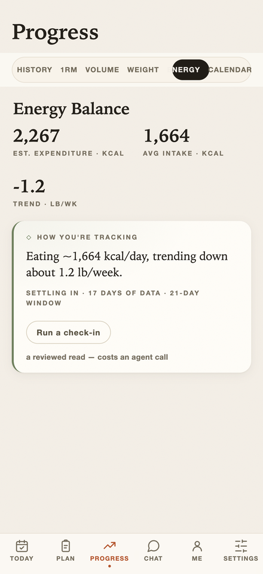<br><sub><b>Adaptive nutrition.</b> Expenditure derived from your weight trend — lean-safe, adherence-neutral, never blamey.</sub></td>
<td valign="top">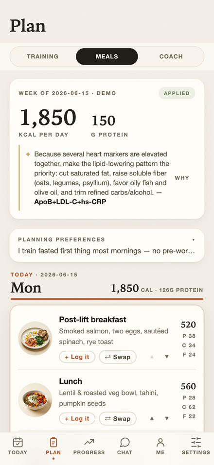<br><sub><b>Goal-aware meals.</b> Protein-anchored weekly plans, shaped by the same flagged labs (oily fish &amp; soluble fiber for ApoB, iron on long-run days).</sub></td>
</tr>
<tr>
<td valign="top">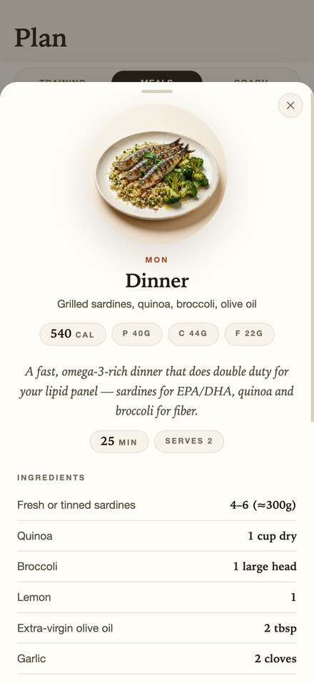<br><sub><b>Recipe on tap.</b> Any planned meal expands into a full recipe — ingredients, steps and tips — written for that exact dish.</sub></td>
<td valign="top">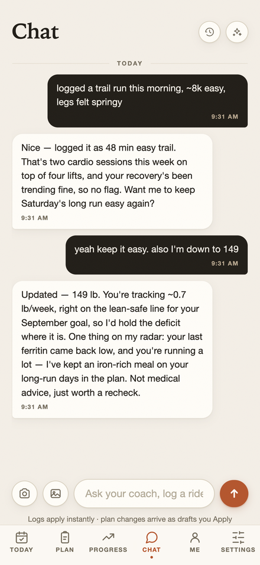<br><sub><b>Coach chat.</b> Logs the easy things instantly and stages plan changes as drafts you approve.</sub></td>
<td valign="top">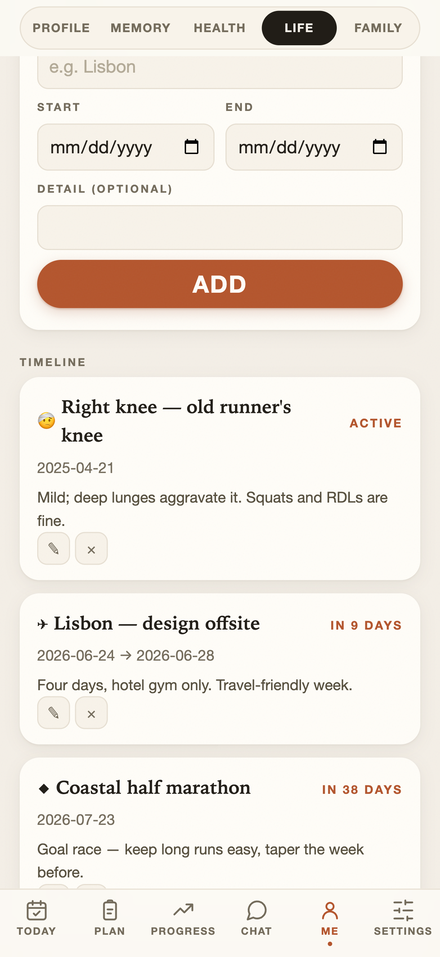<br><sub><b>Life &amp; family.</b> Trips, injuries and the people you plan around — the coach eases off accordingly.</sub></td>
</tr>
</table>

<p align="center">
  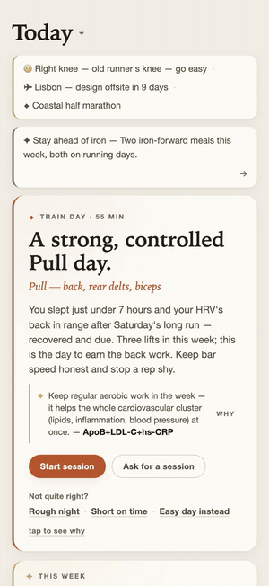
  &nbsp;&nbsp;
  
  <br>
  <sub>The Brief (left) and the connected brain (right), top to bottom.</sub>
</p>

<sub>Every screenshot uses a <b>fictional</b> demo persona — no real health data. Populate the same demo yourself with <code>npm&nbsp;run&nbsp;seed:demo</code>.</sub>

## Quickstart (30 seconds)

```bash
git clone https://github.com/zilet/cairn.git
cd cairn
./quickstart.sh
```

That's it. The script detects Docker (preferred, no Node needed on the host) or falls back to
local Node 24, starts Cairn, waits for health, and prints the URL. Open
**http://localhost:8787** — you land on the Brief immediately.

**First paint is real**, no agent required. Chat, coaching drafts, and meal plans need one
external agent (Claude Code, Codex, Antigravity, or Grok) — or enable the built-in `stub`
agent in Settings to explore offline. See
[Connect your first agent](docs/QUICKSTART.md#connect-your-first-agent) in the full guide.

### Pick a run target

| If you want... | Start here |
|---|---|
| Try Cairn on your laptop | `./quickstart.sh` |
| Keep it always-on at home | `./scripts/quickstart-rpi.sh` on a Raspberry Pi or small home box |
| Run it on a cheap VM | Docker + Tailscale; see [`docs/QUICKSTART.md#small-vm-private-online-box`](docs/QUICKSTART.md#small-vm-private-online-box) |
| Try it on demand in the cloud | [`docs/SANDBOX.md`](docs/SANDBOX.md) for Daytona / Codespaces / Gitpod |

For Raspberry Pi: `./scripts/quickstart-rpi.sh` handles Docker install, arm64 checks, low-memory
notes, and prints the Tailscale Serve command for an installable phone PWA.

For a throwaway **cloud sandbox** (Daytona / GitHub Codespaces / Gitpod) with persistent storage —
spin it up on demand, stop it when idle to cut cost — see [`docs/SANDBOX.md`](docs/SANDBOX.md). A
`.devcontainer/` is included, so "open in cloud" works out of the box.

## Quick links

| Doc | What it covers |
|---|---|
| [`docs/QUICKSTART.md`](docs/QUICKSTART.md) | 30-second start, Raspberry Pi, VM, Docker, Node, agent setup |
| [`docs/SANDBOX.md`](docs/SANDBOX.md) | Run on Daytona / Codespaces / Gitpod (on-demand, persistent) |
| [`docs/DEPLOYMENT.md`](docs/DEPLOYMENT.md) | Tailscale, HTTPS PWA, Pi/VM, backups |
| [`docs/OPERATIONS.md`](docs/OPERATIONS.md) | Updates, migrations, restore |
| [`docs/APPLE_HEALTH.md`](docs/APPLE_HEALTH.md) | iOS Shortcut → `/api/health-metrics` (Apple Health / Oura / Whoop) |
| [`docs/API.md`](docs/API.md) · [`docs/MCP-TOOLS.md`](docs/MCP-TOOLS.md) | Generated REST + MCP reference (`npm run docs:index`) |
| [`docs/VISION.md`](docs/VISION.md) | Product constitution |
| [`docs/WHY-CAIRN.md`](docs/WHY-CAIRN.md) | How Cairn compares (vs MacroFactor, Oura/Garmin, ChatGPT) |
| [`CHANGELOG.md`](CHANGELOG.md) | Release history |

Coaching needs an agent: either a coaching CLI logged in on the host (or an `ANTHROPIC_API_KEY` /
`OPENAI_API_KEY` / `XAI_API_KEY` in the environment), or pick the built-in **`stub`** agent in
Settings to exercise the propose/apply loop offline with no key. Without one, draft/coach actions
fall through silently.

## Run With Docker

Cairn is designed to run wherever you already keep personal services: your
laptop, a small home server, a VM, a Raspberry Pi, or a private Tailscale /
WireGuard network. The same container can be started only when you need it or
left running full-time.

For a local source checkout:

```bash
docker compose up -d --build
```

Then open `http://localhost:8787`.

For a published release image, use the release compose file:

```bash
mkdir cairn
cd cairn
curl -LO https://github.com/zilet/cairn/releases/latest/download/docker-compose.yml
docker compose up -d
```

See [`docs/SHARING.md`](docs/SHARING.md) for the GHCR publishing flow.

- `cairn-data` volume = SQLite DB; `cairn-home` volume = all CLI logins. Rebuilds never touch either.
- **No built-in auth by default** — keep Cairn behind localhost, a LAN, Tailscale/VPN, or another
  trusted private network, and never expose the port to the public internet. If the port is reachable
  beyond loopback, set **`CAIRN_AUTH_TOKEN`** (env / `.env`) to require a shared token on `/api` and
  `/mcp`; the PWA prompts for it once and stores it. See [`SECURITY.md`](SECURITY.md).
- The container runs its main process as a non-root user. To run a one-off command that must persist
  a login in the home volume, pass `-u app` (see the login commands below).
- For an installable/offline PWA, serve it over HTTPS on your private network. Plain HTTP works for
  basic use, but browsers will not register the service worker except on secure origins.
- See "Coaching agents" below for the one-time login per provider.

### Common Deployment Shapes

- **Occasional local app:** run `docker compose up -d` on your laptop, use
  `http://localhost:8787`, then stop it when you are done.
- **Always-on box or VM:** run the release compose on any Docker host. Keep the
  host private; set `CAIRN_AUTH_TOKEN` if another device can reach the port.
- **Tailscale / MagicDNS:** run Cairn on a home server, VM, or Pi joined to your
  tailnet, then open it from your phone or laptop with a tailnet hostname. For
  installable PWA/offline support, put HTTPS in front of the container with
  Tailscale Serve, Caddy, nginx, or another private-network reverse proxy.
- **Public cloud VM:** do not expose `8787` directly to the public internet.
  Bind it to localhost or a private interface, then reach it through a VPN,
  tailnet, SSH tunnel, or an authenticated reverse proxy.

## What Cairn tracks

- **Lifting** (precise): the 5-day plan with per-exercise targets, logged sets, est-1RM trends.
  This is the part that gets actively optimized.
- **Profile & goal**: a neutral example profile ships seeded — replace it with your own in the Me
  tab (or first-run onboarding). The **goal check** computes TDEE (Mifflin-St Jeor x activity
  factor) and tests feasibility against a lean-safe loss rate (<=1 %/wk). It flags aggressive goals
  and recommends a realistic intake/timeline — e.g. a 20 lb-in-10-weeks target (~2 lb/wk) is
  flagged, with a recommended pace of ~1.35 lb/wk over ~15 weeks at the matching intake and protein
  floor.
- **Activities** (plain text): log a run or ride in natural language - "ran 50 min @ 5:30/km" or
  "MTB through the fells for 2 hours". Cairn parses type / duration / distance / pace **instantly**
  (offline), then — if enrichment is on — a background agent refines the entry and distills any
  notable durable fact into memory. The coach factors cardio load into training progression.
- **Memory**: durable notes (preferences, constraints, insights) that every coach prompt reads, so
  planning keeps improving as the picture fills in. Notes come from chat, manual entry, or
  background enrichment of your logs; you can curate them in the **Me → Memory** view (or via the
  `update_memory` / `delete_memory` MCP tools).
- **Meal plans**: goal-aware weekly drafts that use the lean-safe target and protein floor (never a
  crash deficit), respecting food preferences in memory.
- **Food notes** (optional, no daily logging): see below.
- **Health records**: upload bloodwork / DEXA / other docs (PDF or photo) in Me → Health; an agent
  reads the file in the background, extracts structured markers + a plain-language summary, and
  distills notable flags into memory. Markers feed coaching (e.g. low ferritin → caution on
  endurance volume) through feedback-aware directives: Done means handled for that result, Dismiss
  suppresses that advice family until the marker materially changes. Informational, not medical
  advice.
- **Life context**: trips, injuries, and life events (Me → Life) with dates the coach plans
  **around** — travel-friendly/deload weeks over a trip, de-loading an injured area, easing volume
  during a rough stretch. Active/upcoming items surface on Today.
- **Garmin source data** (experimental): sync Garmin Connect activities and daily recovery
  metrics into normalized source tables. Garmin stays an input signal — manual Cairn lifting logs
  remain the strength-progression source of truth. See **[`docs/GARMIN.md`](docs/GARMIN.md)** for
  local connector setup and official Garmin API request wording.

## The chat-driven parts (food photos, free-text)

The headless CLIs in the container handle scheduled/triggered **text** optimization. The inputs that
need vision or loose natural language are best done from a **Claude client** (which has vision +
memory) talking to Cairn's MCP server:

- Snap a plate -> in Claude: *"this was lunch, estimate it"* -> Claude estimates and calls
  `log_food_note`. No daily logging; just occasional snapshots that nudge the meal proposals.
- *"log my ride: 2h in the fells, felt strong"* -> `log_activity`.
- *"I'm down to 176, push the goal date out two weeks"* -> `set_profile`.

## Coaching agents (one login per provider, then it runs)

There is no single login across providers. You sign in once per provider; the `cairn-home` volume
keeps each login across restarts.

| agent | CLI | subscription | headless | chat streaming | auth dir |
|---|---|---|---|---|---|
| `claude` | Claude Code | Anthropic Pro/Max | `claude -p` | ✅ token deltas | `~/.claude` |
| `codex` | Codex | ChatGPT | `codex exec` | one-shot | `~/.codex` |
| `antigravity` | Antigravity (`agy`) | Google plan | `agy -p` | one-shot | `~/.gemini` |
| `grok` | Grok Build | SuperGrok/X Premium+ | `grok -p` | ✅ token deltas | xAI (headless may need `XAI_API_KEY`) |
| `stub` | built-in | none | - | - | offline test agent |

> **Google coach path:** Google is transitioning **Gemini CLI → Antigravity CLI**; Cairn uses
> `agy` (auth under `~/.gemini`). Headless streaming is not available yet — chat falls back to
> one-shot for Codex and Antigravity.

Bake CLIs in via compose build args (`INSTALL_CLAUDE/CODEX/ANTIGRAVITY/GROK`). Log in once:
```bash
docker compose exec -u app -it cairn claude       # /login (URL + code)
docker compose exec -u app -it cairn codex login
docker compose exec -u app -it cairn agy          # Google sign-in (paste code fast, ~30s)
```
Notes: `claude -p` on subscription draws from a separate Agent SDK credit pool from 2026-06-15;
`agy`/`grok` are beta installers - verify them on your target architecture.

Cairn does **not** proxy a shared API key or shared subscription. The container only ships the
runner binaries; each user logs in with their own Claude / ChatGPT / Google / xAI account, and
the `cairn-home` Docker volume keeps those auth directories across restarts and image updates.

### Updating CLI tools

The image installs the latest enabled CLIs at build time. For a long-running install, update them
from **Settings → Agents → Update CLI tools**, or from the shell:

```bash
docker compose exec -u app cairn cairn-update-agent-clis
```

To force a fresh CLI install during an image rebuild without a full Docker cache wipe:

```bash
AGENT_CLI_CACHE_BUST=$(date +%s) docker compose build cairn
docker compose up -d
```

Automatic runtime updates are opt-in:

```bash
AGENT_CLI_AUTO_UPDATE=1 AGENT_CLI_AUTO_UPDATE_INTERVAL_HOURS=168 docker compose up -d
```

Keep this on a trusted local host or tailnet. Updating CLIs runs vendor install scripts inside the
container; it should not be enabled for an internet-exposed deployment.

### Agent rotation & settings
Open the **Settings** tab (or `get_settings`/`set_settings` over MCP) to choose how Cairn picks an
agent when you don't name one: **round-robin** (even rotation across your subscriptions), **random**
(dice), or **priority** (top of the list first). Toggle individual agents on/off and reorder them —
disable a provider that isn't logged in and the rest keep working. Any "auto" draft tries the chosen
order and **falls through on failure**, so a dead login never blocks a proposal. In the Coach tab,
pick **⟳ Auto** to use this rotation, or pick a specific agent.

### Let it run
In **Settings → Weekly auto-coach**, enable it and set the day/hour. Weekly it drafts a training
proposal (via the rotation) that waits in the Coach tab. It never auto-applies; you review and tap
Apply. (First boot seeds these from `COACH_AGENT`/`COACH_DAY`/`COACH_HOUR` in `.env` if set.)
Sanity-check every proposal against how your body actually feels (the seed plan ships with generic
form cues — add your own injury constraints per exercise in the Plan editor). Docker defaults to
`TZ=America/New_York`; set `TZ` in `.env` to the user's local timezone so the configured day/hour
means local time rather than UTC. For Belgrade:

```env
TZ=Europe/Belgrade
```

## Connect MCP to Claude Code
```bash
claude mcp add --transport http cairn http://localhost:8787/mcp
```
Cairn registers ~100 MCP tools spanning the whole app — plan & sessions, exercises, progress &
volume, the propose/apply coach loop, profile & goal, bodyweight & activities, memory, meal plans &
recipes, food notes, health records & markers, the connected-brain directives & insights, the
day-read Brief & on-demand session suggestions, recovery & adaptive nutrition, check-ins & daily
metrics, family, chat, Garmin sync, life-context events, and settings. A representative slice:
`get_plan`, `log_set`, `get_day_read`, `suggest_session`, `draft_plan_update`, `apply_proposal`,
`draft_meal_plan`, `swap_meal`, `get_recovery`, `get_priority_markers`, `list_directives`,
`generate_insight`, `log_activity`, `log_food_note`, `set_profile`, `sync_garmin`. Use your MCP
client's tool listing for the full, current set (defined in `src/mcp.ts`).

There's also a packaged Claude Code skill at `.claude/skills/cairn/` that maps everyday phrases
("log my ride", "update my plan", "how am I tracking") to these tools.

## Updating & migrations

```bash
git pull && docker compose up -d --build
```

Schema migrations run automatically on every boot (`runMigrations()` in `src/migrate.ts`,
tracked via `PRAGMA user_version`) — no manual step. See [docs/OPERATIONS.md](docs/OPERATIONS.md)
for the full update/backup/restore/rollback playbook and how to add a new migration.

## API

All routes are under `/api` (112 in total; see `src/api.ts` for the authoritative set). Grouped:

```
Training & plan   GET /plan[/:day]  PUT /plan  PUT|DELETE /plan/:day  PUT /plan/:day/target
                  GET|POST /exercises  PUT /exercises/:id  GET /exercise/:name
                  POST /sets  DELETE /sets/:id  GET /sessions[?date=]  GET /sessions/:id
                  POST /sessions/:id/finish  POST /sessions/:date/feedback  POST|DELETE /sessions/skip
                  GET /progress/:exercise  GET /volume  GET /calendar  GET /stats  GET /last-set
Brief             GET /today-read  POST /session-suggest
Profile & goal    GET|PUT /profile  GET /goal  GET|POST /bodyweight
Logging & memory  GET|POST /activities  GET /activities/:id  GET|POST|DELETE /food-notes[/:id]
                  GET|POST /memory  PUT|DELETE /memory/:id
Nutrition & meals GET /nutrition/expenditure  POST /nutrition/checkin  GET /frequent-foods
                  POST /coach/mealplan  GET /mealplans  POST /mealplans/:id/:status
                  POST /meal-plans/:id/swap  POST /meal-plans/:id/recipe  PUT /meal-plans/:id/days
Recovery & metrics GET /recovery  GET|POST /checkins  GET|POST /health-metrics
Connected brain   GET|POST /health-docs  GET /health-docs/:id[/file]  POST /health-docs/:id/reanalyze
                  PUT|DELETE /health-docs/:id  GET /health/markers  GET /markers/priority
                  GET|POST /health/review  GET /directives  PUT /directives/:id  POST /directives/derive
                  GET /insights  POST /insights/generate  PUT /insights/:id
Life & family     GET|POST /context-events  PUT|DELETE /context-events/:id
                  GET|POST /family  PUT|DELETE /family/:id
Coach & chat      GET /agents  POST /agent/run  GET /proposals  POST /proposals/:id/(apply|discard)
                  GET|POST|DELETE /chat  POST /chat/reset  GET /chat/search  GET /chat/sessions[/:archivedAt]
Garmin (exp.)     GET|POST /garmin/sources  POST /garmin/sync  GET|POST /garmin/daily
                  GET|POST /garmin/activities  POST /garmin/reconcile  GET /garmin/summary
Art, settings, ops GET /art  POST /art/warm  GET /art/stats  GET|PUT /settings
                  GET|POST /agent-clis/update  GET /export  GET /export/db  GET /health
```

## Notes
- Assisted lifts: negative weight. Bodyweight: null. Est-1RM = Epley on best set/day.
- Goal math is guidance, not medical advice; it deliberately steers away from crash deficits.
- No built-in auth by default — keep it on a trusted private network (and `cairn-home` holds live
  OAuth tokens). Set `CAIRN_AUTH_TOKEN` to gate `/api` and `/mcp` if the port is reachable beyond
  loopback. See [`SECURITY.md`](SECURITY.md).

## Contributing & license
Contributions welcome — see [`CONTRIBUTING.md`](CONTRIBUTING.md) (Node 24, the thin-adapter rule, the
migration + service-worker conventions) and [`CODE_OF_CONDUCT.md`](CODE_OF_CONDUCT.md). Licensed under [MIT](LICENSE).

## Stack
Node 24 + TypeScript - Express - node:sqlite - @modelcontextprotocol/sdk - vanilla PWA - Docker.
