<p align="center">
  <a href="LICENSE"></a>
  <a href="https://github.com/zilet/cairn/releases/latest"></a>
  <a href="https://github.com/zilet/cairn/pkgs/container/cairn"></a>
  <a href="https://github.com/zilet/cairn/actions/workflows/ci.yml"></a>
  <a href="https://github.com/zilet/cairn/stargazers"></a>
</p>

# Cairn — a self-hosted wellness OS

**A self-hosted health coach with a brain, not a dashboard.** Cairn reads your labs, lifting,
running, food, sleep and life as one picture and suggests the one thing worth doing today. It runs
on your own hardware, keeps your data in a SQLite file you own, and never scores or nags you.

<p align="center">
  
  <br>
  <sub>The Brief → the whole-picture analysis → the connected brain → progress → recipes → coach chat &middot; made with fictional demo data</sub>
</p>

<p align="center">
  <a href="https://codespaces.new/zilet/cairn"></a>
</p>

> **Want to look before you install?** One click runs a real Cairn, preloaded with fictional demo
> data, in your browser — nothing on your machine. More cloud options: [`docs/SANDBOX.md`](docs/SANDBOX.md).

## What it is

- **It reads your day.** Cairn opens to a calm **Brief** — rest, easy, or train, in plain language,
  with the reasoning shown. A suggestion, never a gate. You drive.
- **It connects your labs to your meals and your training.** A flagged marker propagates into
  concrete nutrition, training and watch directives, each with its why and a citation.
- **Adaptive nutrition that never blames you.** Expenditure is derived from your real weight trend;
  a thin logging week lowers confidence instead of scolding. `change: false` is the common answer.
- **Lifting and running plans that evolve.** Earned overloads, deloads where you stalled, a
  conservative ramp and taper toward a race — adapting to the work you actually did.
- **Your lifts show up on your watch.** Garmin sync is two-way: sleep, HRV and activities come in,
  and a finished strength session goes back out as that day's exercise sets — written onto the
  watch's own recording when there is one, in Garmin's own exercise vocabulary. Your whole history
  can follow, one reviewed batch at a time.
- **Agent-native.** A full MCP server ships alongside the PWA, so any MCP client can read and write
  everything Cairn knows.

One Node service serves the PWA (`/`), the REST API (`/api/*`), the MCP server (`/mcp`), and a
background scheduler; storage is SQLite via Node's built-in `node:sqlite`. The north-star is
[`docs/VISION.md`](docs/VISION.md): calm, suggestion-never-gate, no scores, pull-never-push.

## Screens

<table>
<tr>
<td width="33%" valign="top">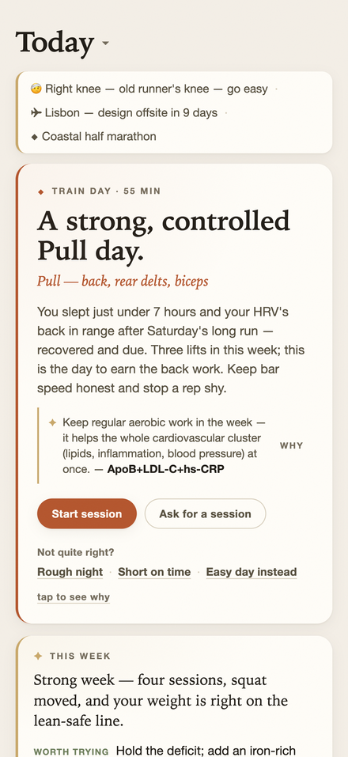<br><sub><b>The Brief.</b> Opens already having read your recovery and load — a calm rest/easy/train <i>suggestion</i> with one-tap overrides. Never a gate.</sub></td>
<td width="33%" valign="top">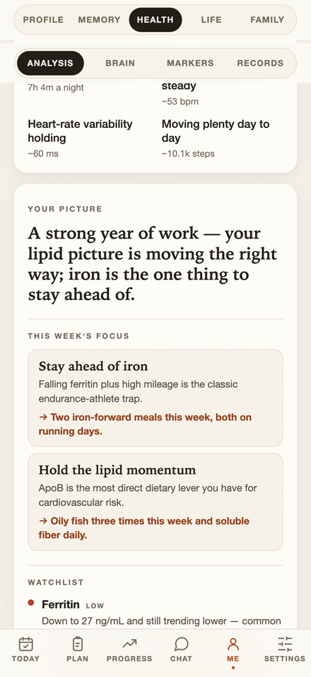<br><sub><b>The analysis.</b> The agentic brain's whole-picture read — what's going well, this week's focus with concrete actions, and what's out of order.</sub></td>
<td width="33%" valign="top">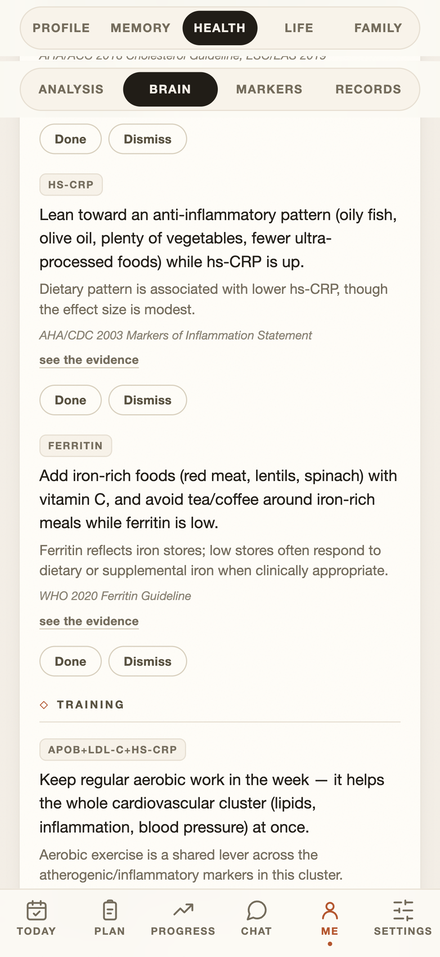<br><sub><b>Propagation.</b> A flagged lab becomes concrete nutrition / training / watch directives — each with its plain-language why and a citation.</sub></td>
</tr>
<tr>
<td valign="top">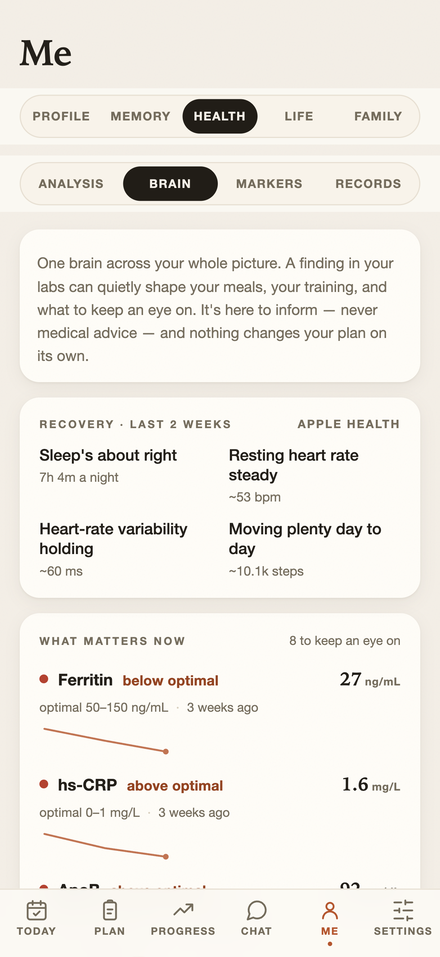<br><sub><b>The connected brain.</b> Recovery in plain language (no scores) and the markers worth watching, framed against the <i>optimal</i> range.</sub></td>
<td valign="top">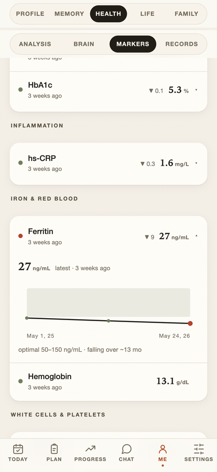<br><sub><b>Optimal-zone trends.</b> Each marker plotted against the longevity band — not just the lab's reference range — with the trend in words.</sub></td>
<td valign="top">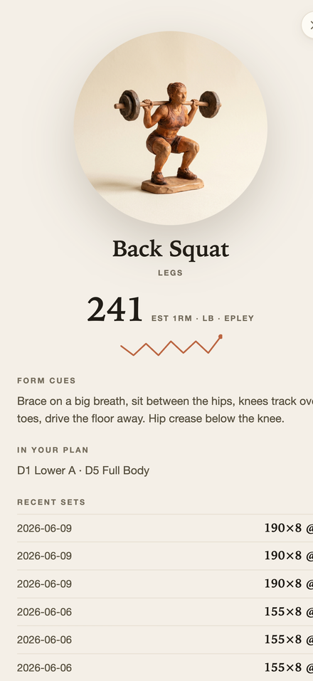<br><sub><b>Every exercise, illustrated.</b> Tap any lift for its est-1RM trend, form cues and history — with a generated studio illustration.</sub></td>
</tr>
<tr>
<td valign="top">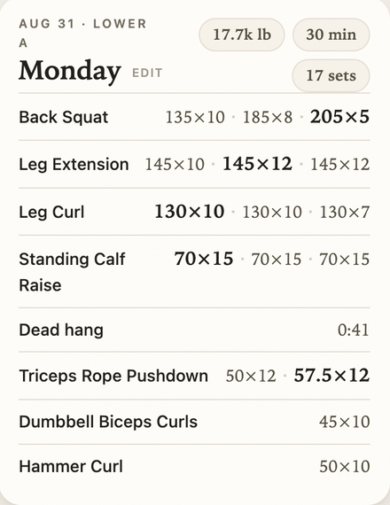<br><sub><b>Logged in Cairn…</b> A session as you logged it on your phone — sets, loads, a timed hold — no watch involved.</sub></td>
<td valign="top">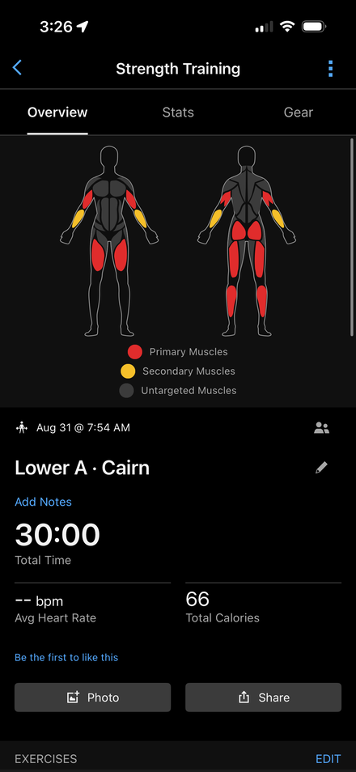<br><sub><b>…lands on Garmin.</b> The same workout appears in Garmin Connect as that day's strength activity, muscle map and all.</sub></td>
<td valign="top">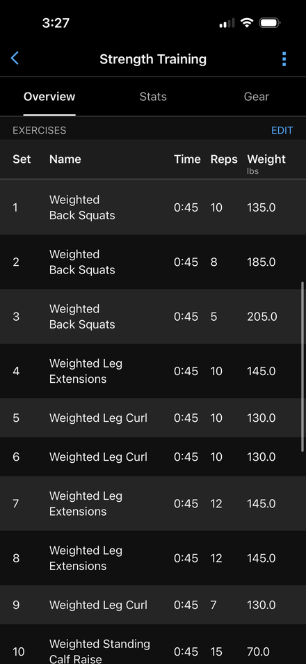<br><sub><b>In the watch's own words.</b> Every set written in Garmin's exercise vocabulary — reps, loads, order — so your history reads natively there too.</sub></td>
</tr>
<tr>
<td valign="top">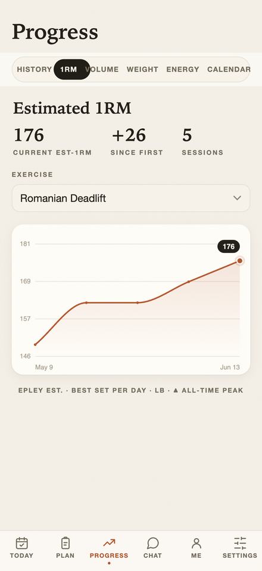<br><sub><b>Strength.</b> Est-1RM trend per lift, plus history, volume-by-muscle and a calendar heatmap.</sub></td>
<td valign="top">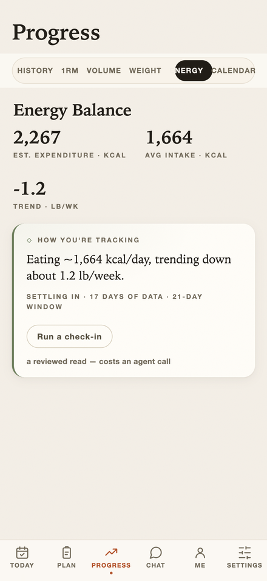<br><sub><b>Adaptive nutrition.</b> Expenditure derived from your weight trend — lean-safe, adherence-neutral, never blamey.</sub></td>
<td valign="top">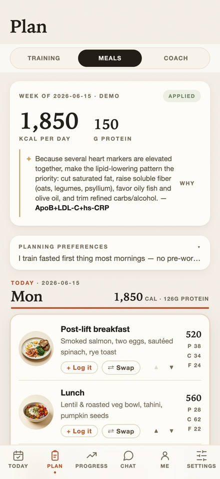<br><sub><b>Goal-aware meals.</b> Protein-anchored weekly plans, shaped by the same flagged labs (oily fish &amp; soluble fiber for ApoB, iron on long-run days).</sub></td>
</tr>
<tr>
<td valign="top">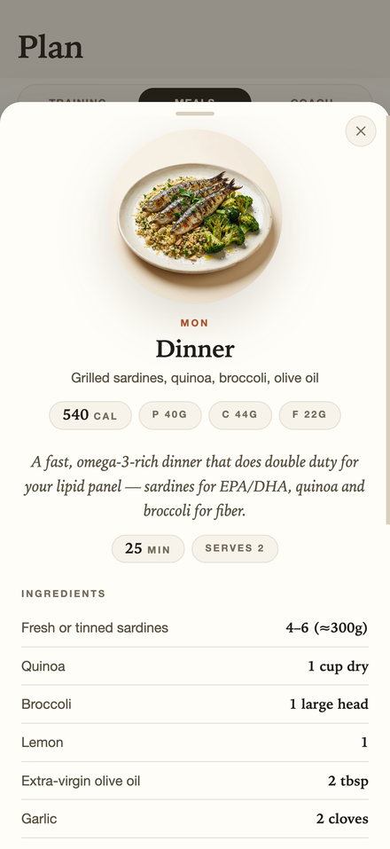<br><sub><b>Recipe on tap.</b> Any planned meal expands into a full recipe — ingredients, steps and tips — written for that exact dish.</sub></td>
<td valign="top">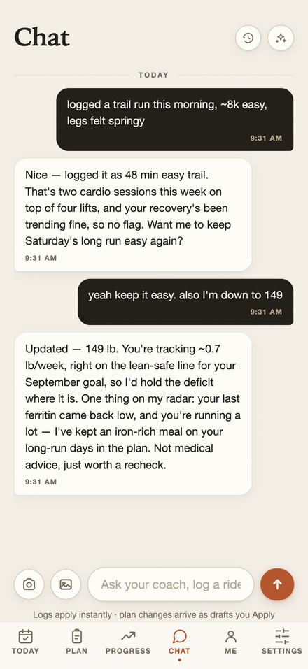<br><sub><b>Coach chat.</b> Logs safe things instantly, learns from your direction, and routes plan changes through accountable autonomy.</sub></td>
<td valign="top">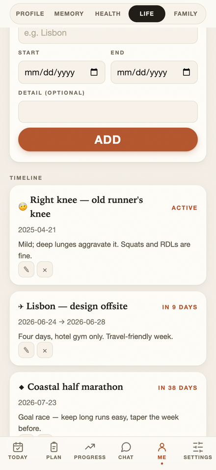<br><sub><b>Life &amp; family.</b> Trips, injuries and the people you plan around — the coach eases off accordingly.</sub></td>
</tr>
</table>

<p align="center">
  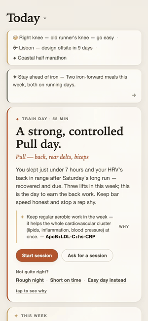
  &nbsp;&nbsp;
  
  <br>
  <sub>The Brief (left) and the connected brain (right), top to bottom.</sub>
</p>

<sub>Every screenshot uses a <b>fictional</b> demo persona — no real health data. Populate the same demo yourself with <code>npm&nbsp;run&nbsp;seed:demo</code>.</sub>

## Quickstart (30 seconds)

You don't need the source. The image is published to GHCR (multi-arch, amd64 + arm64):

```bash
docker run -d --name cairn -p 127.0.0.1:8787:8787 \
  -v cairn-data:/data -v cairn-home:/home/app \
  -v cairn-tools:/home/app/.cairn-tools \
  --restart unless-stopped ghcr.io/zilet/cairn:latest
```

Open **http://localhost:8787** — you land on the Brief immediately. Three named volumes keep your
data (`cairn-data`), your CLI logins (`cairn-home`), and any tools you install (`cairn-tools`)
across updates, so rebuilds touch none of them. To update: `docker pull ghcr.io/zilet/cairn:latest`
and re-run. Add `-e TZ=America/New_York` for your timezone — set your own.

Prefer a compose file, with the env vars and loopback-safe defaults already wired up? Or want the
source, to build locally and develop?

```bash
curl -LO https://github.com/zilet/cairn/releases/latest/download/docker-compose.yml && docker compose up -d
git clone https://github.com/zilet/cairn.git && cd cairn && ./quickstart.sh
```

`quickstart.sh` detects Docker (preferred, no Node needed on the host) or falls back to local Node
24, starts Cairn, waits for health, and prints the URL. **Node 24 is required** for a non-Docker
run — that's where `node:sqlite` is unflagged. The Docker image bundles it.

**First paint is real**, no agent required. For chat, adaptive coaching, and meal plans, add **one**
agent: open **Settings → Agents**, tap **Install** on the provider you use, then **Connect**. A
terminal opens in the browser and walks you through that provider's sign-in — no `docker exec`
needed. An agent you haven't connected stays out of the rotation rather than failing requests. Full
detail, including terminal logins and the Grok API-key path:
[Connect your first agent](docs/QUICKSTART.md#connect-your-first-agent).

> [!IMPORTANT]
> **Security & where to run it.** Cairn ships with **no authentication by default** — it is a
> single-user app built for a network you already trust, **not the public internet**. Run it on your
> own machine, a home server, or a small VM. The simplest setup that is both private and reachable
> from your phone: put the host on a [Tailscale](https://tailscale.com) (or similar) network and open
> it by its **MagicDNS** name — no ports forwarded, no certificates to manage. **Never expose port
> `8787` to the open internet.** If any untrusted device can reach it, set `CAIRN_AUTH_TOKEN` to
> require a shared token, and serve it over HTTPS (Tailscale Serve / a private reverse proxy) so the
> PWA can install offline. See [`SECURITY.md`](SECURITY.md) and [`docs/DEPLOYMENT.md`](docs/DEPLOYMENT.md).

### What works out of the box vs. what needs a coaching agent

Cairn is **fully usable the moment it boots**, with no agent and no API key. A coaching agent
adds the conversational and generative layer on top — and the app stays useful while you set
one up.

| Works out of the box (no agent) | Needs a logged-in coaching agent |
|---|---|
| The Brief — calm rest/easy/train suggestion | The agentic Brief sentence (the plain-language read on top) |
| Set-by-set logging, history, PRs, est-1RM | Coach **chat** |
| The plan editor (add/remove/reorder days) | Agent-shaped training and meal adaptations |
| Bodyweight chart, goal feasibility check | Health-review **narrative** |
| Optimal-zone marker trends & the marker catalog | Lab-document **marker extraction** (upload → structured markers) & quiet **insights** / weekly read |
| Recovery view, deterministic TDEE / expenditure | Recipe generation, single-meal swaps |
| Activities, food notes, memory, family, life context | Background enrichment of free-text logs |
| Endurance stats, run compliance, race countdown, PRs | Agent-refined weekly run prescriptions |

A **coaching agent** means one of the supported CLIs — **Claude Code**, **Codex**,
**Antigravity**, or **Grok** — installed into Cairn's persistent home volume **and logged in** with
your own account. There is no shared key and no built-in model: install only providers you use. The
built-in `stub` agent exercises Cairn's offline agent contract with no key, for smoke testing before
you connect a real coach.

### Pick a run target

| If you want... | Start here |
|---|---|
| Just run it on your laptop (no clone) | the `docker run … ghcr.io/zilet/cairn:latest` above |
| Build from source / develop | `./quickstart.sh` |
| Keep it always-on at home | `./scripts/quickstart-rpi.sh` on a Raspberry Pi or small home box |
| Put it on your phone as an installable PWA | `./scripts/setup-phone.sh` (Tailscale Serve, tailnet-only) |
| Give a household member a private profile | Run one isolated released instance per person; see [`docs/HOUSEHOLDS.md`](docs/HOUSEHOLDS.md) |
| Run it on a cheap VM | Docker + Tailscale; see [`docs/QUICKSTART.md#small-vm-private-online-box`](docs/QUICKSTART.md#small-vm-private-online-box) |
| Try it on demand in the cloud | [`docs/SANDBOX.md`](docs/SANDBOX.md) for Daytona / Codespaces |

## MCP server

Cairn is agent-native: the same logic the PWA uses is exposed as an MCP server at `/mcp`
(Streamable HTTP), so a Claude client — or any other MCP client — can read and write everything.
Point Claude Code at it with one command:

```bash
claude mcp add --transport http cairn http://localhost:8787/mcp
```

**260+ MCP tools** span the plan, sessions and exercises, the accountable coaching loop, profile and
goal, activities and bodyweight, memory, meal plans and recipes, health records and markers, the
connected-brain directives and insights, recovery, chat, Garmin sync, and settings. A representative
slice: `get_plan`, `log_set`, `get_day_read`, `suggest_session`, `draft_plan_update`,
`apply_proposal`, `draft_meal_plan`, `swap_meal`, `get_priority_markers`, `list_directives`,
`generate_insight`, `log_activity`, `log_food_note`, `set_profile`, `sync_garmin`.

This is where vision and loose natural language belong — snap a plate and say *"this was lunch,
estimate it"*, or *"log my ride: 2h in the fells, felt strong"*. Packaged Claude Code and Codex
skills at `.claude/skills/cairn/` and `.agents/skills/cairn/` map everyday phrases to these tools.

The same surface is reachable over REST — **300+ routes** under `/api`. Both
indexes are generated from source and never hand-edited: [`docs/MCP-TOOLS.md`](docs/MCP-TOOLS.md)
and [`docs/API.md`](docs/API.md).

## Why not just use…

**MacroFactor?** Its adherence-neutral expenditure model is the right way to do adaptive nutrition,
and Cairn adopts the same philosophy on purpose. The difference is that here nutrition is one domain
rather than the whole product — a meal target can be shaped by a flagged lab or suppressed during a
travel week, automatically. *MacroFactor wins* if you want a refined single-purpose nutrition app
maintained for you and you don't want to host anything.

**Oura / Garmin / Whoop?** Wearables are the best in the world at measurement, and Cairn reads
*from* them rather than replacing them. What it adds is synthesis instead of a metric wall, and the
loop your watch leaves open: Garmin records the run you did, Cairn writes the run you should do
next — and a finished strength session goes back out onto the watch as that day's exercise sets.
*The wearable wins* on precise passive measurement — keep it, and let Cairn talk to it.

**ChatGPT and a spreadsheet?** The closest comparison, and genuinely capable. Cairn is what happens
when you make that loop durable: every coaching call is already grounded in your profile, plan,
sessions, labs and memory, a flagged lab *propagates* into directives still there next week, and
nothing changes your plan without propose → review → apply. *ChatGPT wins* for a one-off question
with zero setup.

**Another self-hosted tracker?** Most are excellent ledgers — they record what you did, well. Cairn
is trying to be the thing that reads across those records and points at one action. *A focused
tracker wins* if you want a stable offline log and no agent in the loop at all.

The longer, fully honest version is [`docs/WHY-CAIRN.md`](docs/WHY-CAIRN.md).

## What Cairn is not

- **Not a social app.** No feed, no friends, no leaderboards, no sharing.
- **Not a multi-user SaaS.** Cairn is single-user by design. No account system, no billing, no team
  management.
- **Not medical advice.** Health findings are informational. It is a buddy who reads your numbers,
  not a doctor — anything clinical defers to a clinician.
- **Not a wearable.** It has no sensors of its own; it reads from the ones you already have.
- **Not an engagement machine.** No streaks, points, badges, push nags, or upsell. It has nothing to
  sell and no one to retain. If it ever feels like it's trying to keep you in the app, that's a bug.
- **Not zero-setup.** It's self-hosted. That's the price of owning your data and your model.

## Your data: what stays, what leaves

Everything Cairn knows about you lives in one SQLite file on your own machine — there's no
Cairn-run server for it to sync to. When an agentic feature runs (chat, adaptive coaching, a
generated meal plan, a health review), your coach context goes to whichever model provider you
connected — Anthropic, OpenAI, Google, or xAI — for that one call, and nowhere else. With no agent
configured, the deterministic core (the Brief, logging, plans, charts, the connected brain) runs
with zero outbound calls. Garmin and Apple Health sync talk only to those services, using your own
credentials.

## Docs

| Doc | What it covers |
|---|---|
| [`docs/QUICKSTART.md`](docs/QUICKSTART.md) | 30-second start, Raspberry Pi, VM, Docker, Node, agent setup |
| [`docs/DEPLOYMENT.md`](docs/DEPLOYMENT.md) · [`docs/OPERATIONS.md`](docs/OPERATIONS.md) | Tailscale, HTTPS PWA, updates, migrations, backup/restore |
| [`docs/HOUSEHOLDS.md`](docs/HOUSEHOLDS.md) · [`docs/SANDBOX.md`](docs/SANDBOX.md) | Private profiles per person; Daytona / Codespaces |
| [`docs/APPLE_HEALTH.md`](docs/APPLE_HEALTH.md) · [`docs/GARMIN.md`](docs/GARMIN.md) | Bringing sleep, HRV and activities in; Garmin sync is two-way, with finished strength sessions going back out |
| [`docs/API.md`](docs/API.md) · [`docs/MCP-TOOLS.md`](docs/MCP-TOOLS.md) | Generated REST + MCP reference (`npm run docs:index`) |
| [`docs/VISION.md`](docs/VISION.md) · [`docs/WHY-CAIRN.md`](docs/WHY-CAIRN.md) | The product constitution; how Cairn compares, at length |
| [`docs/ARCHITECTURE.md`](docs/ARCHITECTURE.md) · [`CHANGELOG.md`](CHANGELOG.md) | Subsystem depth for contributors; release history |

Schema migrations run automatically on every boot, so an update is `docker pull` and re-run.

## Why I built this

I had the data — years of lifts, a watch on my wrist, bloodwork in a folder — and none of it talked
to anything else. Every app was excellent at its one column and blind to the other five. I didn't
want another dashboard to interpret; I wanted something that had already read all of it before I
opened it, and had one honest thing to say.

So the rules came first. No scores, because a number you must decode is the opposite of calm. No
notifications, because a tool that has to interrupt you hasn't earned being opened. Suggestions
rather than gates, because it's my body and my day. Self-hosted, because a system that knows this
much about you should live on hardware you own.

A cairn is a stack of stones on a trail. It doesn't shout, it doesn't follow you, and it doesn't
tell you where to go — it sits at the junction and marks the path, and you consult it when you get
there. That's the whole idea.

## Contributing & license

Contributions welcome — see [`CONTRIBUTING.md`](CONTRIBUTING.md) (Node 24, the thin-adapter rule,
the migration + service-worker conventions) and [`CODE_OF_CONDUCT.md`](CODE_OF_CONDUCT.md).
Licensed under [MIT](LICENSE). Built with Node 24 + TypeScript, Express, `node:sqlite`,
`@modelcontextprotocol/sdk`, a vanilla PWA, and Docker.

<a href="https://star-history.com/#zilet/cairn&Date">
  
</a>
