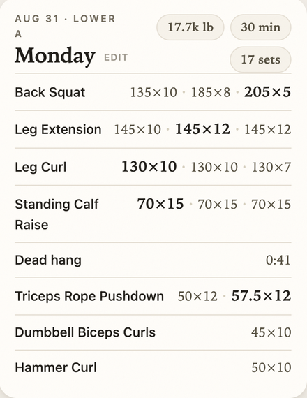
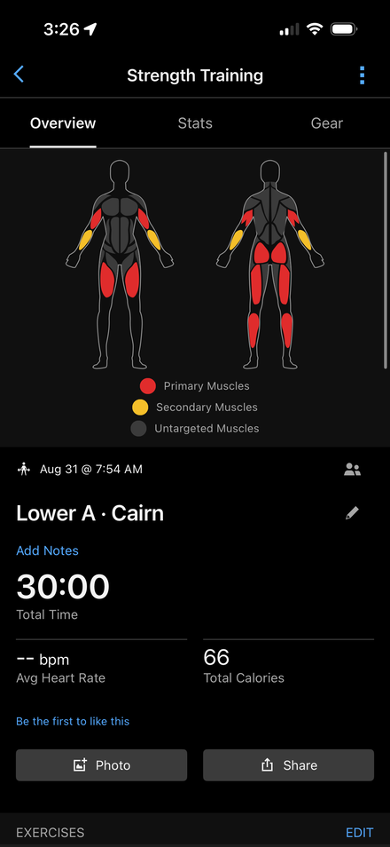
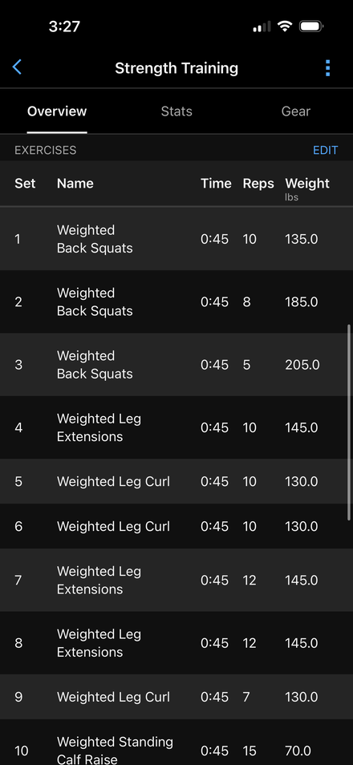
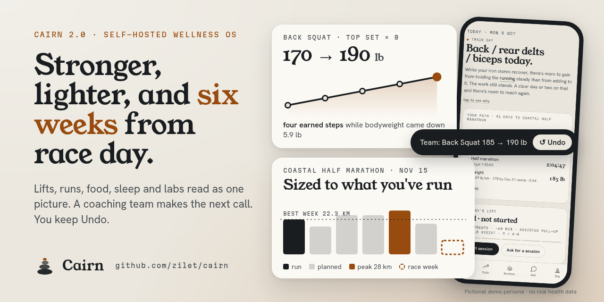

<p align="center">
  <a href="LICENSE"></a>
  <a href="https://github.com/zilet/cairn/releases/latest"></a>
  <a href="https://github.com/zilet/cairn/pkgs/container/cairn"></a>
  <a href="https://github.com/zilet/cairn/actions/workflows/ci.yml"></a>
</p>


# Cairn — a self-hosted wellness OS

**A coach that has already read your whole day, and has one honest thing to say.**

Cairn reads your lifting, running, food, sleep, labs and life as one picture. It opens to a calm
read of today: rest, easy or train, with the reasons shown. A team of specialists works quietly
behind it, makes the small calls, and gives you a one-tap Undo for each one. It runs on your own
hardware, keeps everything in a SQLite file you own, and never scores you or nags you.

<p align="center">
  
  <br>
  <sub>The Brief → a team change with Undo → food in your words &middot; <a href="media/v2/cairn-v2-trailer.mp4">watch the full 2.0 trailer</a> &middot; fictional demo data only</sub>
</p>

<p align="center">
  <a href="https://codespaces.new/zilet/cairn"></a>
</p>

> **Want to look before you install?** One click runs a real Cairn, preloaded with fictional demo
> data, in your browser. Nothing touches your machine. More cloud options: [`docs/SANDBOX.md`](docs/SANDBOX.md).

## Cairn 2.0: from a read to a team

Version 1 learned to **read** you. It turned years of lifts, a watch's worth of nights and a folder of
bloodwork into one quiet sentence each morning.

Version 2 is about **what happens next**. The read now has a team behind it, and the team acts:

- A strength step you earned **lands on its own**. It comes with the reason and an Undo.
- A race build is **sized to the weeks you actually ran**, not to a template.
- A meal you typed in plain words **comes back as a card you can correct**.
- A flagged lab **follows you into the doctor's office** in clinical order.

The app also got simpler. Eight tabs became five homes: **Today, Train, Horizon, Ask and You.** It
has a new design (Atelier v2), its own type, and a cairn of six stones that is the whole of you at
a glance.

The rules didn't change, and they never will. There are no scores and no streaks. Nothing is pushed
at you. Every read is a suggestion; you drive. Anything clinical still waits for you to say yes.

<table>
<tr>
<td width="50%" valign="top" align="center"></td>
<td width="50%" valign="top"><br><h3>It reads your day.</h3>
Today opens on an answer, not a dashboard. <b>Rest, easy or train</b>, in one sentence, with the
evidence a tap away. That evidence is last night's sleep, your HRV against <i>your own</i> band,
the load you carried this week, and the knee you mentioned on Tuesday. When the answer is easy, it
offers easy things that still count. When you want to train anyway, the button says so.
<br><br><sub>A suggestion, never a gate. A missing night says nothing, never "bad".</sub></td>
</tr>
<tr>
<td valign="top"><br><h3>The team decides. You can Undo.</h3>
Strength, endurance, nutrition, physio and an informational health seat each watch their part of
you. When the evidence is clear, a bounded change (the next load step, an eased calorie target)
<b>just lands</b>, with its why written in plain words. Every change sits in one <b>Changes</b>
feed, labelled by the server with exactly what Undo restores. Anything clinical, irreversible or
goal-changing still asks first.
<br><br><sub>Autonomy is server policy, not model discretion. Every decision is recorded with a falsifiable expectation.</sub></td>
<td valign="top" align="center"></td>
</tr>
<tr>
<td valign="top" align="center"></td>
<td valign="top"><br><h3>Food, in your words.</h3>
"Salmon rice bowl, about 140 g of fish." One composer, shared by Fuel and chat, turns a line per
food (or a photo of the plate) into a meal card you can correct row by row. <b>Ideas</b> come from
your own staples, one meal at a time, and nothing counts as eaten until you log it. A thin logging
day reads as absent, never as "low".
<br><br><sub>Adaptive nutrition that never blames you. <code>change: false</code> is the common answer.</sub></td>
</tr>
<tr>
<td valign="top"><br><h3>A race build sized to you.</h3>
Name a half marathon and Horizon draws the road to it week by week, from the run engine's own next
steps. <b>The best week you've already run safely sets the floor, and the peak aims just past
it.</b> A down week is recovery, not lost ground. A hard lifting day never voids a running week. The
finish estimate is a fit word (<i>fits</i>, <i>stretch</i>, <i>beyond horizon</i>), never a grade.
<br><br><sub>Kilometres or miles, your call. Strength-led athletes keep progressing all the way to race week.</sub></td>
<td valign="top" align="center"></td>
</tr>
<tr>
<td valign="top" align="center"></td>
<td valign="top"><br><h3>Six stones. One picture.</h3>
<b>You</b> is a cairn: strength, endurance, fuel, recovery, body and heart, each with one word for
where it stands right now. Tap a stone to see what it is made of and which of its neighbours it
leans on. A ferritin that is still catching up quietly holds the running back. A heart stone
"worth noting" points at the lab that says why.
<br><br><sub>Words and your own baseline, never a 0–100.</sub></td>
</tr>
<tr>
<td valign="top"><br><h3>Labs that travel.</h3>
A flagged marker doesn't sit in a PDF. It <b>propagates</b> into the meals, the training and the
watch, each with its why and a citation. Records are grouped in clinical order, with the lab's own
flag kept apart from the optimal band. Before a visit, the <b>doctor packet</b> builds itself:
findings, your questions, body composition, results by panel. Toggle sections, preview, hand it over.
<br><br><sub>Informational, never medical advice. Anything clinical defers to a clinician.</sub></td>
<td valign="top" align="center"></td>
</tr>
<tr>
<td valign="top" align="center"></td>
<td valign="top"><br><h3>One line of time.</h3>
<b>Horizon</b> puts the week, the race and the season on the same line. The week shows every
sport as a dose: the moved long run is still the long run, and Saturday's ride is the
cross-training day. The season shows the goal line with its likely window, with lab draws and
scans pinned where they happened.
<br><br><sub>Every logged activity counts. No sport is ever dose zero.</sub></td>
</tr>
</table>

## What it is

- **It reads your day.** Today opens on a calm **Brief**: rest, easy or train, in plain language,
  with the reasoning shown. A suggestion, never a gate. You drive.
- **A coaching team that acts, with Undo.** Strength, endurance, nutrition, physio and an
  informational health seat each name the next step toward your milestones. Bounded, reversible
  changes land on their own, with the why and one tap to put them back. The rest asks. A quiet
  weekly team review waits until you want it.
- **It connects your labs to your meals and your training.** A flagged marker propagates into
  concrete nutrition, training and watch directives, each with its why and a citation. A doctor
  packet carries them to your next visit.
- **Adaptive nutrition that never blames you.** Expenditure comes from your real weight trend. A
  thin logging week lowers confidence instead of scolding.
- **Lifting and running plans that evolve.** Earned overloads, deloads only when the log calls for
  them, and a race build that starts from what you've already run safely. It adapts to the work you
  actually did, in every sport you log.
- **It reads you against your own normal.** Recovery is judged against your own habitual load and
  your own wearable baselines. A reading only speaks for the night it came from, so a hybrid
  athlete's running is never mistaken for permanent fatigue.
- **Conditions you live with shape the plan, never gate it.** Tell it about a painless structural
  condition (a spinal curve, a stiff ankle) and plans stay balanced and whole, with optional
  supportive work.
- **Your lifts show up on your watch.** Garmin sync is two-way. Sleep, HRV and activities come in.
  A finished strength session goes back out as that day's exercise sets, in Garmin's own exercise
  vocabulary.
- **Agent-native.** A full MCP server (300+ tools) ships alongside the PWA, so any MCP client can
  read and write everything Cairn knows. "What if I move the long run to Saturday?" shows the ripple
  across every stone before anything moves.

One Node service serves the PWA (`/`), the REST API (`/api/*`), the MCP server (`/mcp`), and a
background scheduler. Storage is SQLite via Node's built-in `node:sqlite`. The north star is
[`docs/VISION.md`](docs/VISION.md): calm, suggestion-never-gate, no scores, pull-never-push.

## Screens

<table>
<tr>
<td width="25%" valign="top"><br><sub><b>Today.</b> The Brief as the page's voice, your path to the race, today's lift and fuel at a glance.</sub></td>
<td width="25%" valign="top"><br><sub><b>Session.</b> Compact cards, with a dawn ring on the lift you're on.</sub></td>
<td width="25%" valign="top"><br><sub><b>Changes.</b> What the team changed, why, and exactly what Undo restores.</sub></td>
<td width="25%" valign="top"><br><sub><b>Ask: what if.</b> The ripple across every stone first. Nothing moves unless you say so.</sub></td>
</tr>
<tr>
<td valign="top"><br><sub><b>Horizon.</b> The race build as terrain: logged weeks, planned weeks, the long run.</sub></td>
<td valign="top"><br><sub><b>Race.</b> This week's shape, next week's runs, the ladder to race day.</sub></td>
<td valign="top"><br><sub><b>You.</b> Six parts of you, read together.</sub></td>
<td valign="top"><br><sub><b>A stone, opened.</b> What it's made of and the neighbours it leans on.</sub></td>
</tr>
<tr>
<td valign="top"><br><sub><b>Health.</b> Where you stand, and what each finding connects to.</sub></td>
<td valign="top"><br><sub><b>Doctor packet.</b> Clinical order, your questions, ready to hand over.</sub></td>
<td valign="top"><br><sub><b>Train.</b> Today's lift leads, then a voice instead of a stat wall.</sub></td>
<td valign="top"><br><sub><b>And at night.</b> Every surface, in a dark theme built for it.</sub></td>
</tr>
<tr>
<td valign="top"><br><sub><b>Logged in Cairn…</b> A session as you logged it on your phone: sets, loads, a timed hold.</sub></td>
<td valign="top"><br><sub><b>…lands on Garmin.</b> The same workout, as that day's strength activity, muscle map and all.</sub></td>
<td valign="top"><br><sub><b>In the watch's own words.</b> Every set in Garmin's exercise vocabulary.</sub></td>
<td valign="top"><br><sub><b>Cairn 2.0.</b> Self-hosted. MIT. Runs happily on a Raspberry Pi.</sub></td>
</tr>
</table>

<sub>Every screenshot and clip uses a <b>fictional</b> demo persona, never real health data. Populate the same demo yourself with <code>npm&nbsp;run&nbsp;seed:demo</code>, and re-record every clip with <code>npm&nbsp;run&nbsp;promo</code>.</sub>


## Quickstart (30 seconds)

You don't need the source. The image is published to GHCR (multi-arch, amd64 + arm64):

```bash
docker run -d --name cairn -p 127.0.0.1:8787:8787 \
  -v cairn-data:/data -v cairn-home:/home/app \
  -v cairn-tools:/home/app/.cairn-tools \
  --restart unless-stopped ghcr.io/zilet/cairn:latest
```

(Podman works as-is: `podman run …`.) Open **http://localhost:8787** — you land on the Brief immediately. Three named volumes keep your
data (`cairn-data`), your CLI logins (`cairn-home`), and any tools you install (`cairn-tools`)
across updates, so rebuilds touch none of them. To update: `docker pull ghcr.io/zilet/cairn:latest`
and re-run. Add `-e TZ=America/New_York` for your timezone — set your own.

Prefer a compose file, with the env vars and loopback-safe defaults already wired up? Or want the
source, to build locally and develop?

```bash
curl -LO https://github.com/zilet/cairn/releases/latest/download/docker-compose.yml && docker compose up -d
git clone https://github.com/zilet/cairn.git && cd cairn && ./quickstart.sh
```

`quickstart.sh` resolves a running container engine — Docker, Podman, or Apple's `container`,
whichever is installed and answering (preferred, no Node needed on the host) — or falls back to
local Node, starts Cairn, waits for health, and prints the URL. **Node 24+ is required** (26 recommended — it's what the image ships) for a
non-container run — that's where `node:sqlite` is unflagged. The container image bundles it.

**First paint is real**, no agent required. For chat, adaptive coaching, and meal plans, add **one**
agent: open **You → Agents**, tap **Install** on the provider you use, then **Connect**. A
terminal opens in the browser and walks you through that provider's sign-in — no `docker exec`
needed. An agent you haven't connected stays out of the rotation rather than failing requests. Full
detail, including terminal logins and the Grok API-key path:
[Connect your first agent](docs/QUICKSTART.md#connect-your-first-agent).

> [!IMPORTANT]
> **Security & where to run it.** Cairn ships with **no authentication by default** — it is a
> single-user app built for a network you already trust, **not the public internet**. Run it on your
> own machine, a home server, or a small VM. The simplest setup that is both private and reachable
> from your phone: put the host on a [Tailscale](https://tailscale.com) (or similar) network and open
> it by its **MagicDNS** name — no ports forwarded, no certificates to manage. **Never expose port
> `8787` to the open internet.** If any untrusted device can reach it, set `CAIRN_AUTH_TOKEN` to
> require a shared token, and serve it over HTTPS (Tailscale Serve / a private reverse proxy) so the
> PWA can install offline. See [`SECURITY.md`](SECURITY.md) and [`docs/DEPLOYMENT.md`](docs/DEPLOYMENT.md).

### What works out of the box vs. what needs a coaching agent

Cairn is **fully usable the moment it boots**, with no agent and no API key. A coaching agent
adds the conversational and generative layer on top — and the app stays useful while you set
one up.

| Works out of the box (no agent) | Needs a logged-in coaching agent |
|---|---|
| The Brief — calm rest/easy/train suggestion | The agentic Brief sentence (the plain-language read on top) |
| Set-by-set logging, history, PRs, est-1RM | Coach **chat** |
| The plan editor (add/remove/reorder days) | Agent-shaped training and meal adaptations |
| Bodyweight chart, goal feasibility check | Health-review **narrative** |
| Optimal-zone marker trends & the marker catalog | Lab-document **marker extraction** (upload → structured markers) & quiet **insights** / weekly read |
| Recovery view, deterministic TDEE / expenditure | Recipe generation, single-meal swaps |
| Activities, food notes, memory, family, life context | Background enrichment of free-text logs |
| Endurance stats, run compliance, race countdown, PRs | Agent-refined weekly run prescriptions |
| Movement considerations, strength milestones and fit words | The weekly team review (one step per milestone) |

A **coaching agent** means one of the supported CLIs — **Claude Code**, **Codex**,
**Antigravity**, or **Grok** — installed into Cairn's persistent home volume **and logged in** with
your own account. There is no shared key and no built-in model: install only providers you use. The
built-in `stub` agent exercises Cairn's offline agent contract with no key, for smoke testing before
you connect a real coach.

### Pick a run target

| If you want... | Start here |
|---|---|
| Just run it on your laptop (no clone) | the `docker run … ghcr.io/zilet/cairn:latest` above |
| Build from source / develop | `./quickstart.sh` |
| Keep it always-on at home | `./scripts/quickstart-rpi.sh` on a Raspberry Pi or small home box |
| Put it on your phone as an installable PWA | `./scripts/setup-phone.sh` (Tailscale Serve, tailnet-only) |
| Give a household member a private profile | Run one isolated released instance per person; see [`docs/HOUSEHOLDS.md`](docs/HOUSEHOLDS.md) |
| Run it on a cheap VM | Docker + Tailscale; see [`docs/QUICKSTART.md#small-vm-private-online-box`](docs/QUICKSTART.md#small-vm-private-online-box) |
| Try it on demand in the cloud | [`docs/SANDBOX.md`](docs/SANDBOX.md) for Daytona / Codespaces |

## MCP server

Cairn is agent-native: the same logic the PWA uses is exposed as an MCP server at `/mcp`
(Streamable HTTP), so a Claude client — or any other MCP client — can read and write everything.
Point Claude Code at it with one command:

```bash
claude mcp add --transport http cairn http://localhost:8787/mcp
```

**300+ MCP tools** span the plan, sessions and exercises, the accountable coaching loop, profile and
goal, activities and bodyweight, memory, meal plans and recipes, health records and markers, the
connected-brain directives and insights, recovery, chat, Garmin sync, and settings. A representative
slice: `get_plan`, `log_set`, `get_day_read`, `suggest_session`, `draft_plan_update`,
`apply_proposal`, `draft_meal_plan`, `swap_meal`, `get_priority_markers`, `list_directives`,
`generate_insight`, `log_activity`, `log_food_note`, `set_profile`, `sync_garmin`.

This is where vision and loose natural language belong — snap a plate and say *"this was lunch,
estimate it"*, or *"log my ride: 2h in the fells, felt strong"*. Packaged Claude Code and Codex
skills at `.claude/skills/cairn/` and `.agents/skills/cairn/` map everyday phrases to these tools.

The same surface is reachable over REST — **300+ routes** under `/api`. Both
indexes are generated from source and never hand-edited: [`docs/MCP-TOOLS.md`](docs/MCP-TOOLS.md)
and [`docs/API.md`](docs/API.md).

## Why not just use…

**MacroFactor?** Its adherence-neutral expenditure model is the right way to do adaptive nutrition,
and Cairn adopts the same philosophy on purpose. The difference is that here nutrition is one domain
rather than the whole product — a meal target can be shaped by a flagged lab or suppressed during a
travel week, automatically. *MacroFactor wins* if you want a refined single-purpose nutrition app
maintained for you and you don't want to host anything.

**Oura / Garmin / Whoop?** Wearables are the best in the world at measurement, and Cairn reads
*from* them rather than replacing them. What it adds is synthesis instead of a metric wall, and the
loop your watch leaves open: Garmin records the run you did, Cairn writes the run you should do
next — and a finished strength session goes back out onto the watch as that day's exercise sets.
*The wearable wins* on precise passive measurement — keep it, and let Cairn talk to it.

**ChatGPT and a spreadsheet?** The closest comparison, and genuinely capable. Cairn is what happens
when you make that loop durable: every coaching call is already grounded in your profile, plan,
sessions, labs and memory, a flagged lab *propagates* into directives still there next week, and
nothing changes your plan outside server-owned policy: a bounded change lands with its why and an
Undo, and anything clinical still asks. *ChatGPT wins* for a one-off question
with zero setup.

**Another self-hosted tracker?** Most are excellent ledgers — they record what you did, well. Cairn
is trying to be the thing that reads across those records and points at one action. *A focused
tracker wins* if you want a stable offline log and no agent in the loop at all.

The longer, fully honest version is [`docs/WHY-CAIRN.md`](docs/WHY-CAIRN.md).

## What Cairn is not

- **Not a social app.** No feed, no friends, no leaderboards, no sharing.
- **Not a multi-user SaaS.** Cairn is single-user by design. No account system, no billing, no team
  management.
- **Not medical advice.** Health findings are informational. It is a buddy who reads your numbers,
  not a doctor — anything clinical defers to a clinician.
- **Not a wearable.** It has no sensors of its own; it reads from the ones you already have.
- **Not an engagement machine.** No streaks, points, badges, push nags, or upsell. It has nothing to
  sell and no one to retain. If it ever feels like it's trying to keep you in the app, that's a bug.
- **Not zero-setup.** It's self-hosted. That's the price of owning your data and your model.

## Your data: what stays, what leaves

Everything Cairn knows about you lives in one SQLite file on your own machine — there's no
Cairn-run server for it to sync to. When an agentic feature runs (chat, adaptive coaching, a
generated meal plan, a health review), your coach context goes to whichever model provider you
connected — Anthropic, OpenAI, Google, or xAI — for that one call, and nowhere else. With no agent
configured, the deterministic core (the Brief, logging, plans, charts, the connected brain) runs
with zero outbound calls. Garmin and Apple Health sync talk only to those services, using your own
credentials.

## Docs

| Doc | What it covers |
|---|---|
| [`docs/QUICKSTART.md`](docs/QUICKSTART.md) | 30-second start, Raspberry Pi, VM, Docker, Node, agent setup |
| [`docs/DEPLOYMENT.md`](docs/DEPLOYMENT.md) · [`docs/OPERATIONS.md`](docs/OPERATIONS.md) | Tailscale, HTTPS PWA, updates, migrations, backup/restore |
| [`docs/HOUSEHOLDS.md`](docs/HOUSEHOLDS.md) · [`docs/SANDBOX.md`](docs/SANDBOX.md) | Private profiles per person; Daytona / Codespaces |
| [`docs/APPLE_HEALTH.md`](docs/APPLE_HEALTH.md) · [`docs/GARMIN.md`](docs/GARMIN.md) | Bringing sleep, HRV and activities in; Garmin sync is two-way, with finished strength sessions going back out |
| [`docs/API.md`](docs/API.md) · [`docs/MCP-TOOLS.md`](docs/MCP-TOOLS.md) | Generated REST + MCP reference (`npm run docs:index`) |
| [`docs/VISION.md`](docs/VISION.md) · [`docs/WHY-CAIRN.md`](docs/WHY-CAIRN.md) | The product constitution; how Cairn compares, at length |
| [`docs/ARCHITECTURE.md`](docs/ARCHITECTURE.md) · [`CHANGELOG.md`](CHANGELOG.md) | Subsystem depth for contributors; release history |

Schema migrations run automatically on every boot, so an update is `docker pull` and re-run.

## Why I built this

I had the data — years of lifts, a watch on my wrist, bloodwork in a folder — and none of it talked
to anything else. Every app was excellent at its one column and blind to the other five. I didn't
want another dashboard to interpret; I wanted something that had already read all of it before I
opened it, and had one honest thing to say.

So the rules came first. No scores, because a number you must decode is the opposite of calm. No
notifications, because a tool that has to interrupt you hasn't earned being opened. Suggestions
rather than gates, because it's my body and my day. Self-hosted, because a system that knows this
much about you should live on hardware you own.

A cairn is a stack of stones on a trail. It doesn't shout, it doesn't follow you, and it doesn't
tell you where to go — it sits at the junction and marks the path, and you consult it when you get
there. That's the whole idea.

## Help it find the people it's for

Cairn is young, and it grows the way it behaves: quietly, by word of mouth, from people it actually
helps. If that's you, three things move it further than anything else:

- **Star the repo** if these are the rules you'd want for your own data. It's how the next person
  finds it.
- **Show how you run it** in [Discussions](https://github.com/zilet/cairn/discussions): a Pi on a
  shelf, a NAS, a VPS, a household of three.
- **Open an issue when a read gets you wrong.** A read that missed is the most useful bug report
  Cairn can get.

## Contributing & license

Contributions welcome — see [`CONTRIBUTING.md`](CONTRIBUTING.md) (Node 26, the thin-adapter rule,
the migration + service-worker conventions) and [`CODE_OF_CONDUCT.md`](CODE_OF_CONDUCT.md).
Licensed under [MIT](LICENSE). Built with Node 26 + TypeScript, Express, `node:sqlite`,
`@modelcontextprotocol/sdk`, a vanilla PWA, and Docker.
