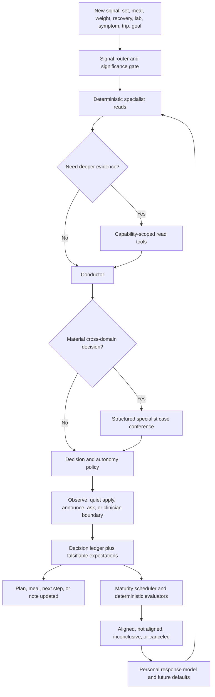

# Cairn Elite Brain Plan

_Drafted 2026-07-09 from a source-level review of the current coaching brain, outcome-learning loop, scheduler, agent runtime, and MCP surfaces. This is an execution plan, not a claim that every item is already built._

_Source-verified 2026-07-09 against the working tree by four parallel review agents (outcome-learning, agent runtime, scheduler/signals, client/constitution). Their corrections are folded in: two claims calibrated (exact MCP tool count; server bind interface) and five design fixes applied (`source_ref` key type, `emitBrainEvent` naming, attention-engine naming, prompt-only safety floors promoted to a Wave-0 code deliverable, Learned-timeline reuse). Revised the same day on the product owner's direction: the standing objective ("everything better") and lead-mode autonomy (the coach leads; quiet apply / announce-then-apply; chat is the steering wheel) are now the governing model. The experience/performance pillars and the multi-agent execution structure below are the contract for the build._

## Executive verdict

Cairn already has the architecture of a genuinely intelligent coaching system:

- one bounded whole-person context spanning training, endurance, nutrition, body composition, recovery, labs, medications, supplements, family, life events, goals, memory, and learned response patterns;
- deterministic specialist engines for progression, program balance, running, recovery, health directives, cardiovascular risk, body composition, energy expenditure, re-check attention (the attention engine, `src/repo/attention.ts` — a per-signal state machine with tiers `active → confirming → surveillance → released`), and safety;
- a conductor that selects one lead lever, parallel work, deferred work, connections, and a coordinated retest window;
- durable background jobs, quiet proactive reads, reviewable proposals, and pull-only surfacing;
- strong trust boundaries around malformed agent output, load progression, allergies, clinical uncertainty, and secret isolation.

That is substantially more than a health chatbot. The remaining gap is not another recommendation surface. It is **accountable adaptation**: Cairn must remember what it decided, state what it expected to happen, observe what actually happened, admit uncertainty or error, and let those outcomes change future decisions.

The second gap is **depth on demand**. Today an agent receives a carefully bounded `getCoachContext()` snapshot. It cannot safely investigate beyond that snapshot during the run. The right extension is controlled read-only querying, but not direct access to Cairn's full MCP server, which includes write, delete, sync, apply, and nested-agent tools.

The target is:

> A calm multidisciplinary team that continuously reads the whole person, makes one coherent decision, applies what its autonomy policy permits, explains the change where it matters, learns from whether reality agreed — and steers everything toward one standing objective: everything better.

## The standing objective: everything better

The product owner's one-sentence brief (2026-07-09): over any meaningful window, the whole picture should be getting better — longevity and well-being, strength, endurance, body composition, metabolic and clinical markers, recovery. Continuous optimization against that whole-person objective IS the revision plan. Every decision the brain makes is ultimately in service of it.

Concretely:

- The objective is multi-dimensional and expressed in words, never a composite score (the constitution bans grades). Its deterministic form is a **whole-person trajectory read**: per domain — strength, endurance, body composition, metabolic/lab picture, recovery/well-being — a verdict of `better | holding | worse | unknown` over the window, unifying reads that already exist piecemeal (progression, trajectory, standing, expenditure, marker trends) against the objective.
- Trade-offs are explicit and phase-bounded, never silent. A cut knowingly parks strength progression; a race build knowingly parks hypertrophy. Every phase names what it is optimizing and what it is deliberately parking; `worse` in a parked domain is explained by the phase, not flagged as failure. A `worse` that is NOT explained by the active phase is precisely what triggers revision.
- **The revision loop is standing, not reactive-only.** On a regular cadence (monthly, and at every phase boundary) the brain runs a whole-person revision against the objective: what got better, what didn't, what the evaluators learned, and what changes next — routed through the same autonomy postures (typically Tier C: announced, then applied). Between revisions, the signal router handles the reactive corrections (plateaus, rough weeks, new labs, trips).
- The user must FEEL the progress. The weekly read and the monthly revision lead with trajectory in plain language ("stronger on every lift, ApoB falling, engine holding") — and account honestly when a domain isn't moving. That felt, honest progress is the trust that lead-mode autonomy spends.

## Review of the proposed direction

### 1. Prediction to outcome ledger: correct and highest priority

The proposal is directionally right and should be the first major brain build. It starts compounding as soon as decisions are recorded; delaying it loses future learning data.

Current foundations to extend rather than replace:

- `suggestions` (`src/repo/memory.ts`) already records `day_read`, `session_suggest`, and `nutrition_checkin` suggestions with `payload_json` / `outcome_json` / `reconciled_at`.
- `reconcileSuggestions()` (nightly memory tick, also REST/MCP-triggerable) compares a small subset with later behavior; only three `OUTCOME_LESSONS` exist today and lessons persist as `memory` rows of kind `'learning'`.
- `reaction-model.ts` already derives personal patterns via seven deterministic builders (deficit response, load×CRP, event recovery, adherence, volume×soreness, data gaps, intervention→marker) — and already speaks the `tentative | observed | strong` confidence words this plan standardizes on.
- plan proposals, nutrition targets (`nutrition_targets`, written by `acceptNutritionTarget`), directives, meal plans, day reads (`day_reads` — keyed by **date**, no integer id), sessions, insights, attention state, and marker history are already durable.
- deterministic forecasts exist that are never reconciled today (`forecastMarker`, the expenditure projection, trajectory horizons) — cheap early candidates for the expectation ledger.

The proposal needs four refinements.

#### Do not call every observation causal

If calories, training volume, sleep, travel, medication, and bodyweight all change together, Cairn cannot honestly say one intervention caused the result. Evaluations should use these verdicts:

- `aligned`: the observed result landed in the expected direction or band;
- `not_aligned`: enough data exists and the result clearly missed;
- `inconclusive`: sparse data, overlapping changes, illness/travel, or insufficient time prevents a useful verdict;
- `canceled`: the decision was reverted or superseded before maturity.

User-facing language should be "this moved as expected" or "the result did not match the expectation," never "this caused" unless the evidence truly supports it.

#### Record only falsifiable expectations

Not every suggestion needs a prediction. "Keep protein anchored" is not measurable unless Cairn can define the data source, target band, and evaluation window. A decision may have zero, one, or several expectations. Silence is better than fake precision.

#### Evaluate through versioned deterministic policies

The model may propose an expectation, but server code must normalize it to a known metric, unit, maturity window, minimum data requirement, and evaluator version. An agent must not invent executable evaluation SQL or decide its own success after the fact.

#### Learn policies, not anecdotes

A single miss should not become a permanent personality fact. Personal-response updates need evidence counts, recency, confidence words, contradiction handling, and supersession. Repeated aligned/missed decisions should change defaults; one noisy outcome should remain tentative.

### 2. Agent access to deeper data: correct second move, but not near-zero cost

The product idea is right: the context snapshot should become a seed, not a ceiling. A specialist should be able to ask, for example:

- "Show the last six months of this lift, including plan targets and feedback."
- "Show ferritin history with draw dates, units, related directives, and active medications."
- "Compare recovery around the last three high-volume weeks."
- "Show planned versus actual meals or training around the trip."

However, pointing coach subprocesses at the existing `/mcp` endpoint is unsafe as designed:

- the server exposes 191 tools (`docs/MCP-TOOLS.md`; 199 registrations across `src/surfaces/mcp/*`), including writes, deletes, syncs, proposal application, settings changes, and nested agent operations;
- current child-process isolation intentionally strips Cairn's auth token and database paths (`AGENT_ENV_DENYLIST` in `src/agentExecution.ts` — which also strips Garmin and Gemini secrets — must be preserved untouched);
- Claude, Codex, Grok, and Antigravity have different MCP/configuration behavior;
- an agent could recurse into another agentic tool, over-query sensitive data, or mutate state outside the reviewed action path;
- prompt-level instructions are not an authorization boundary.

The correct build is a **server-owned read query catalog** with two adapters:

1. a provider-neutral bounded query loop that works with every CLI;
2. an optional capability-scoped MCP adapter for CLIs that support safe per-run MCP configuration.

Both adapters must expose the same read-only catalog and enforce limits in code.

### 3. Multidisciplinary case conference: necessary for material decisions

The current generative identity is one model asked to be coach, nutritionist, health reader, and lifestyle buddy simultaneously. The deterministic domain engines are real specialists, and the conductor already detects one class of disagreement — a training lever that loads a flagged injury is demoted with a caveat (`coaching-focus.ts` `flaggedContext`/`leverLoadsFlagged`) — but the agentic layer does not independently review material cross-domain decisions, and the deterministic matrix stops there. This wave extends conflict detection (deficit↔recovery, medication↔supplement, allergy↔meal, race↔strength) rather than building it from scratch.

Do not run four agents for every meal or set. Use a case conference only when a decision is both material and cross-domain, such as:

- a fat-loss phase while recovery, thyroid, or iron signals are concerning;
- a plan evolution during injury, travel, or a large endurance build;
- supplement or meal changes that intersect medications or kidney/liver markers;
- a goal-phase change that affects calories, training volume, body composition, and retest timing.

Each specialist returns a small structured opinion. The conductor reconciles conflicts and emits one decision in one voice. Store the structured opinion, not hidden chain-of-thought.

## Product constitution amendment: the coach leads

The original constitution says nothing plan-affecting auto-applies. That rule protected trust while the brain had no memory of its own decisions and no way to be held accountable. The product owner's standing direction (2026-07-09) supersedes it: **Cairn should lead** — monitor, decide, prepare, and adapt like an elite team that acts and then tells you, subtly, what it did and why. The user's job is to live, train, and feel progress — not to operate a review queue. Control shifts from approval-before to visibility-and-instant-correction-after. The accountability spine this plan builds (ledger, expectations, verdicts, undo) is exactly what makes a leading coach trustworthy; the two ship together, never autonomy alone.

This remains a real constitution change. The no-auto-apply stance is load-bearing in at least nine places in `docs/VISION.md` (§1 "it never auto-applies", Principle 1, §4, the §3 retrospective, the propose→review→apply section, the Brief rules, and both hard-rules lists). The amendment text is drafted below; it lands in `docs/VISION.md` as a dated amendment — with pointer edits on the nine affected sentences so the constitution never self-contradicts — in the same change that first enables lead-mode execution. Until that change ships, everything runs with autonomy capped at `review`; the ledger, evaluators, and learning still work.

Autonomy has one hard precondition: safety floors must exist as code, not prompt text. The load-step clamp (`repo/plan.ts` `clampStep`) and the meal macro clamps (`repo/nutrition.ts` `coerceMeal`) are real code clamps today, but the lean-safe calorie floor and allergen exclusion live only in prompt language. Both become server-side clamps in Wave 0, before any autonomous action is possible.

### Autonomy postures

| Tier | Meaning | Examples | Behavior |
| --- | --- | --- | --- |
| A — observe | Read or interpretation only | insight, weekly read, pattern detected | Store quietly; no mutation |
| B — quiet apply (**the default** for coaching-domain changes) | Bounded, reversible, code-clamped | target adjustment, exercise rotation on a plateau, volume bend after a rough night, meal swap within prefs/allergen clamps, schedule shift around a trip | Apply at the next natural boundary, ledger the decision + expectation, leave a subtle "what changed & why" note at the affected item, one-tap undo |
| C — announce, then apply | Structural but still coaching-domain | new training block or split, meaningful calorie shift, meal-plan rewrite | Announced in the Brief and at the affected surface with its effective date (next session/week); proceeds WITHOUT any tap; one-tap "hold on" keeps the current state |
| D — ask first (the exception) | Goal identity, user-locked, or clamp-refused | starting a cut or bulk, anything the user has locked, any action a safety clamp rejected | The classic propose → review → apply loop |
| E — clinician | Clinical, medication, diagnosis, high-risk supplementation | medication/dose change, diagnosis, treatment decision, concerning symptom/lab escalation | Never applied; informational and clinician-directed |

The tier is assigned by server policy from action type, magnitude, domain, reversibility, and clinical involvement. The model may suggest a tier; policy can only demote it, never promote it.

### Lead-mode rules

- **Natural boundaries only.** Changes take effect at the next session, day, or week — never a mid-session mutation, never a mid-week restructure (that is what Tier C's announcement is for).
- **Surprise budget.** At most one material change per domain per week in the normal case; safety responses (injury, illness, red-flag lab) are exempt. An elite team is decisive, not twitchy.
- **Chat is the steering wheel.** "That didn't work for me" / "put it back" reverts the decision via the ledger, records a user-veto evaluation, and the reaction model treats the veto as strong evidence. The user's word always wins instantly.
- **Self-calibrating restraint.** A domain whose changes keep getting reverted or vetoed demotes itself from B to C (announce-first) and says so plainly ("I'll run nutrition changes past you first for a while"). Demotion is deterministic — a revert-rate policy over a window — never a model judgment.
- **One control, not a matrix.** Settings exposes a single "How much should Cairn lead?" — **Lead** (default) / **Announce first** (everything ≥ B behaves as C) / **Review everything** (the legacy loop). No per-tier switchboard.
- **Floors are sovereign.** Injury constraints, lean-safe minimums, allergen exclusion, and clinical boundaries are code clamps that no learned confidence, tier, or model output can weaken. A clamp rejection demotes the action to Tier D with the reason attached.

### Proposed VISION.md amendment (lands when lead-mode ships)

> **Amendment 1 — The coach leads (2026-07).** Cairn began propose-first: nothing plan-affecting applied without a tap. That rule existed to protect trust before Cairn could remember its decisions, state expectations, and be held to outcomes. Now that it can, the relationship matures: **Cairn acts like an elite team — it adapts your training, meals, and week on its own initiative, at natural boundaries, within hard safety floors — and tells you what changed and why, subtly, where it matters.** You still drive: every change is visible, explained, reversible in one tap, and your word in chat wins instantly. Structural changes are announced before they take effect; goal-level changes and anything clinical still ask first — clinical decisions always remain with you and your clinician. Nothing is ever imposed on your body; the plan remains a suggestion you are free to ignore. Where this amendment conflicts with earlier "never auto-applies" language, this amendment governs.

## Experience and performance pillars (non-negotiable, every wave)

The goal is not more machinery; it is that Cairn feels like a super-expensive elite team of experts at all times. Two pillars apply to every wave and every track with the same force as the safety rules.

### Elite experience

- Every wave ships its user-visible texture with it — the payoff is never deferred to a final polish wave. Wave 1 ships the per-item "what changed and why"; Wave 2 verdicts appear in the weekly read and Learned timeline the week evaluators go live; Wave 4's undo and chat-revert ship with the first lead-mode action.
- One voice. The team is invisible; the user meets a single calm coach who can say "I expected X; Y happened; here is what I'm changing." Specialist opinions, verdicts, and tool calls are plumbing — never rendered as a transcript, feed, or activity log.
- Voice and copy are part of every track's deliverable, not an afterthought: verdict language ("this moved as expected" / "the result didn't match what I expected" / "we can't tell yet"), rationale wells, and undo labels follow `docs/DESIGN.md`, and confidence is expressed only in the `tentative | observed | strong` words. No numbers, no grades, no blame, no confetti.
- Reuse the shipped design primitives — `.well-accent*` spined wells, `.linkbtn-quiet` disclosure, toast-action Undo, `relAge`/`absDate` dates, press/motion tokens. A new component class requires a `docs/DESIGN.md` addition in the same change.

### Elite performance

- No user-facing surface EVER blocks on brain work. Every agentic brain operation (conference, query loop, review triggered by a signal) runs through the existing durable background-job machinery, streams its final voice via `runChosenStreaming` where prose-bearing, and degrades to deterministic floors when agents are unavailable.
- Deterministic brain reads stay effectively free: new reads join the version-counter cache pattern (`marker-cache.ts` / `training-cache.ts`), with `test/_isolate.mjs` reset hooks in the same change.
- Evaluators run on the nightly memory-maintenance tick and are pure and cheap: bounded windows, indexed queries, and every new table ships with the indexes its evaluators need. SQLite is synchronous — no unbounded scans on any request path.
- Budgets are enforced in code and telemetered: per-run tool-call caps (6 ordinary / 12 conference), ≤3 query rounds, response byte caps, hard timeouts with abort propagation, and a per-day conference cap. Budget exhaustion degrades to the snapshot-only path — never to an error the user sees.
- New client surfaces follow the shipped perceived-perf patterns: instant paint from a snapshot (localStorage/sessionStorage), SWR via `swr-cache.ts`, the `api()` coalescer, bundle-manifest registration in `scripts/build-client.mjs`, and the mandatory `sw.js` CACHE bump in the same change.

## Target architecture



## Core data model

Use new `CREATE TABLE IF NOT EXISTS` tables in `src/db.ts`; per repository convention, new tables do not require an `ALTER TABLE` migration. Do not overload `plan_proposals` or the existing narrow `suggestions` table until the generalized path is proven.

### `brain_decisions`

One durable record of a meaningful coaching decision, whether observed, auto-applied, reviewed, rejected, reverted, or superseded.

Suggested fields:

```sql
id INTEGER PRIMARY KEY AUTOINCREMENT,
created_at TEXT DEFAULT (datetime('now')),
effective_date TEXT,
kind TEXT NOT NULL,
domain TEXT NOT NULL,
summary TEXT NOT NULL,
rationale TEXT,
source TEXT,
source_ref_type TEXT,
source_ref_key TEXT,
status TEXT NOT NULL,
autonomy_tier TEXT NOT NULL,
risk_class TEXT NOT NULL,
reversible INTEGER DEFAULT 0,
input_fingerprint TEXT,
context_json TEXT,
action_json TEXT,
specialist_json TEXT,
applied_at TEXT,
reverted_at TEXT,
superseded_by INTEGER,
evaluator_version TEXT
```

Rules:

- Store bounded structured facts, not full prompts, raw medical documents, secrets, or chain-of-thought.
- `source_ref_*` links to the existing durable row: `plan_proposal` → `plan_proposals.id`, `nutrition_target` → `nutrition_targets.id`, `directive` → `health_directives.id`, `meal_plan` → `meal_plans.id`, `suggestion` → `suggestions.id` (day reads, session suggestions, and nutrition check-ins all record into `suggestions`; there is no separate session-suggestion table), and `day_read` → `day_reads.date` (that table is keyed by date with no integer id — the reason `source_ref_key` is TEXT).
- `input_fingerprint` deduplicates the same decision under repeated scheduler ticks.
- `context_json` contains only the material baseline facts needed for later evaluation.
- A reversal creates an auditable state transition; history is never erased.

### `brain_expectations`

Zero or more falsifiable expectations attached to one decision.

```sql
id INTEGER PRIMARY KEY AUTOINCREMENT,
decision_id INTEGER NOT NULL REFERENCES brain_decisions(id),
metric_key TEXT NOT NULL,
subject_key TEXT,
direction TEXT NOT NULL,
baseline_json TEXT,
target_json TEXT,
window_start TEXT NOT NULL,
window_end TEXT NOT NULL,
minimum_data_json TEXT,
confounder_policy TEXT,
confidence TEXT NOT NULL,
status TEXT DEFAULT 'pending',
evaluator TEXT NOT NULL,
evaluator_version TEXT NOT NULL,
created_at TEXT DEFAULT (datetime('now'))
```

Known initial `metric_key` values:

- `weight_trend_lb_wk`
- `intake_to_weight_response`
- `exercise_target_completion`
- `exercise_est_1rm_trend`
- `session_performance_feedback`
- `joint_pain_or_soreness`
- `plan_day_adherence`
- `recovery_hrv_delta`
- `recovery_rhr_delta`
- `sleep_duration_delta`
- `marker_direction`
- `body_measurement_direction`

Unknown metric keys are rejected at the write boundary.

### `brain_evaluations`

One or more versioned evaluations of a matured expectation. Re-evaluation is allowed when delayed data arrives; the newest valid evaluation is authoritative while history remains visible.

```sql
id INTEGER PRIMARY KEY AUTOINCREMENT,
expectation_id INTEGER NOT NULL REFERENCES brain_expectations(id),
evaluated_at TEXT DEFAULT (datetime('now')),
verdict TEXT NOT NULL,
actual_json TEXT,
evidence_json TEXT,
confounders_json TEXT,
explanation TEXT,
evaluator_version TEXT NOT NULL
```

`verdict` is limited to `aligned | not_aligned | inconclusive | canceled`.

### `brain_tool_calls`

Sanitized operator telemetry for depth-on-demand reads.

```sql
id INTEGER PRIMARY KEY AUTOINCREMENT,
run_id TEXT NOT NULL,
op TEXT NOT NULL,
tool TEXT NOT NULL,
args_summary TEXT,
rows_returned INTEGER,
latency_ms INTEGER,
status TEXT,
created_at TEXT DEFAULT (datetime('now'))
```

Never store raw health-document content, prompts, secrets, or unrestricted tool results here.

This is per-tool-call telemetry — a different grain from the existing per-CLI-run `agent_runs` table (`recordAgentRun` in `src/repo/agent-telemetry.ts`), which stays as is. Mirror its failure-safe write pattern: telemetry never breaks the loop.

## Evaluation policies and causal hygiene

### Maturity windows

Each evaluator owns its default window and minimum evidence:

- calorie target → weight trend: usually 14–28 days with enough intake and weigh-in coverage;
- training target → performance: 2–4 exposures to the affected movement, not simply elapsed days;
- recovery adjustment → HRV/RHR/sleep: several comparable nights, excluding illness/travel when appropriate;
- marker directive → lab direction: next clinically meaningful draw, often 6–16+ weeks depending on marker;
- body-composition decision → circumference/DEXA: enough time for detectable change, never daily noise.

### Confounders that force `inconclusive`

- decision reverted or superseded before maturity;
- another decision targeting the same metric landed during the window;
- insufficient measurements or obviously sparse nutrition logging;
- illness, injury, travel, acute stress, medication change, or supplement change overlapping the window;
- incompatible units, uncertain marker identity, or a measurement plausibility failure;
- the target was never actually followed or exposed enough times to test.

### Personal-response promotion

The response model should promote a pattern only when:

- at least two comparable decisions agree, or one decision has unusually strong repeated measurements;
- the relationship remains directionally consistent after obvious confounders are excluded;
- a contradictory later pattern supersedes or lowers confidence in the old one;
- the surfaced wording remains a confidence band (`tentative`, `observed`, `strong`), never a numeric grade.

Examples:

- "Your weight trend usually responds less than expected to a 150 kcal adjustment; use a slightly larger step only after two clean misses."
- "High lower-body volume tends to suppress your next two nights of HRV; avoid placing quality running there."
- "This movement rotation improved completion without increasing joint pain across three exposures."
- "The marker moved in the expected direction after the intervention, but medication and weight changed too, so attribution remains uncertain."

## Read-only depth-on-demand catalog

Create a shared `src/brain/read-tools.ts` catalog over domain/repo services. Both the internal query loop and any MCP adapter register from this catalog so schemas and authorization cannot drift.

Initial tools:

| Tool | Purpose | Bounds |
| --- | --- | --- |
| `read_exercise_history` | Plan targets, logged sets, estimated capacity, feedback for one canonical movement | one exercise, maximum 180 days / bounded rows |
| `read_training_window` | Sessions, load, skips, feedback, plan adherence | maximum 12 weeks |
| `read_marker_history` | One canonical marker, source units, flags, directives, medication/supplement context | one marker, bounded history |
| `read_recovery_window` | Sleep, HRV, RHR, stress, body battery around a date range | maximum 90 days, daily aggregates |
| `read_nutrition_window` | Logged intake totals, confidence/coverage, target history, weight trend | maximum 42 days |
| `read_body_composition_history` | Weight, waist, measurement, and DEXA anchors | bounded history |
| `read_life_context_window` | Trips, injuries, illness, family/life events | relevant date range only |
| `read_decision_history` | Prior similar decisions, expectations, verdicts | one coarse kind/subject, bounded |
| `read_current_plan_detail` | Exact affected plan day or meal-plan slice | one day/slice |

Explicitly denied:

- all `set_*`, `update_*`, `delete_*`, `log_*`, `apply_*`, `sync_*`, `draft_*`, and `generate_*` operations;
- raw exports, file paths, uploaded binaries, settings secrets, auth state, agent login, terminal access, and operator tools;
- any tool that launches another agent or durable job;
- arbitrary SQL or unrestricted table access.

Runtime limits:

- maximum 6 tool calls per ordinary run and 12 per case conference;
- maximum 3 query rounds;
- per-tool row/date bounds and response byte cap;
- MCP mode runs its own loopback-bound listener with a short-lived per-run capability token — the main server binds `0.0.0.0` by default (`src/server.ts`), so the public `/mcp` listener is never reused for coach reads, and the token is a new per-run credential, never `CAIRN_AUTH_TOKEN` (which `sanitizeAgentEnv` strips from every agent subprocess);
- hard timeout and cancellation propagation;
- every call audited through `brain_tool_calls`;
- tool results treated as data, never executable instructions.

## Specialist case conference contract

Create a common structured opinion:

```ts
interface SpecialistOpinion {
  domain: "training" | "nutrition" | "health" | "recovery" | "lifestyle";
  recommendation: string;
  rationale: string;
  evidence_keys: string[];
  risks: string[];
  contraindications: string[];
  uncertainties: string[];
  expected_outcomes: ProposedExpectation[];
  autonomy_ceiling: "observe" | "quiet_apply" | "announce" | "ask" | "clinician";
}
```

The conductor output must include:

- the chosen lead decision;
- compatible parallel actions;
- conflicts and how they were resolved;
- what is explicitly deferred;
- the autonomy tier after server policy clamps it;
- measurable expectations, if any;
- the review/retest window;
- one calm user-facing explanation.

Specialist calls may run in parallel, but all receive the same immutable brain snapshot id. That id/sharing layer is a new build: `runWithBrainSnapshot` (`src/brain/snapshot.ts`) gives request-scoped immutability but exposes no id and cannot span parallel subprocesses. A result produced against a materially stale snapshot is discarded or re-run. No specialist writes to the application directly.

## Event-driven signal router

Today the scheduler is cadence-driven: six self-gated 60-second loops (weekly coach draft, the proactive tick's six sub-cadences, Garmin, day-read precompute, nightly memory maintenance, update check). Those loops stay. The router complements them so reaction to a new signal is immediate and cheap instead of waiting for the next cadence — and every log must still not cause an agent call. Add a cheap deterministic signal router at write chokepoints, generalizing the substrate that already exists: ~20 `invalidateDayRead` call sites across 11 modules, the debounced coalescing recompute in `src/dayread-refresh.ts`, the `src/enrichBus.ts` status bus, and the version-counter caches (`marker-cache.ts`, `training-cache.ts`).

Signal sources:

- set logged, session finished, session feedback, exercise skipped or swapped;
- food logged/corrected, weight logged, nutrition target accepted;
- Garmin/Apple recovery metrics, activity sync;
- health document/marker/directive, medication or supplement change;
- body measurement or DEXA;
- injury, illness, trip, family/life event;
- profile, goal, discipline, plan, or meal-plan change.

Router behavior:

1. emit a coarse signal with entity ids and date, never a whole prompt;
2. coalesce related writes (`20` sets become one finished-session event);
3. invalidate/recompute deterministic reads immediately;
4. run significance policies to decide whether a decision review is needed;
5. deduplicate with a stable signature and cooldown;
6. enqueue an agentic review only for material ambiguity or cross-domain impact;
7. create or update a decision/expectation without surfacing noise.

This is the substrate that makes Cairn feel continuously staffed without turning every tap into latency or spend.

## Implementation waves

### Wave 0 — Constitution, contracts, and evaluation harness

Goal: freeze safety and quality criteria before adding autonomy.

Work:

- Finalize the "coach leads" autonomy policy and the VISION.md amendment text (direction approved 2026-07-09; the amendment lands in `docs/VISION.md` with the change that enables lead-mode).
- Define `BrainDecision`, `BrainExpectation`, `BrainEvaluation`, `SpecialistOpinion`, and `CoachReadTool` contracts under `src/brain/`.
- Add pure normalization/type guards for all model-emitted decision and expectation shapes.
- Promote the prompt-only safety floors to code: a server-side lean-safe calorie floor and an allergen ingredient filter (both live only in prompt text today — a precondition for Wave 3's "cannot weaken floors" and for any Tier-B nutrition action).
- Create `test/brain-scenarios/` with longitudinal fixtures and invariant-based assertions.
- Add `npm run brain:eval` for deterministic scenarios; optionally add `brain:eval:agent` for connected-agent evaluation without making it a normal offline test dependency.

Initial scenarios:

- low ferritin plus endurance build plus fatigue;
- elevated ApoB while body composition is improving;
- maintenance goal that must not drift into a deficit;
- aggressive fat-loss request with poor recovery and declining performance;
- stalled bench plus chest/shoulder sensitivity;
- high hs-CRP immediately after hard training;
- travel week with sparse food and recovery logging;
- medication/supplement interaction with kidney/liver markers;
- conflicting strength and race goals;
- thin-data user where the correct answer is uncertainty and one question.

Acceptance:

- no scenario can produce an unsafe autonomous action;
- relevant constraints are cited in structured `evidence_keys`;
- contradictions between plan, nutrition, health, and recovery are detectable;
- thin data produces `inconclusive`/ask-one-question behavior rather than invented certainty.

### Wave 1 — Generalized decision and expectation ledger

Goal: start recording compounding learning data immediately.

Work:

- Add the four new tables and repo modules under `src/repo/brain-decisions.ts` and `src/repo/brain-evaluations.ts`.
- Add a shared `recordDecision()` service; protocol surfaces never insert rows directly.
- Integrate future events first: applied plan proposals, accepted nutrition targets, background plan adjustments, day reads, exercise swaps, and active health directives.
- Backfill only current active state when reliable; do not fabricate historical expectations from old free text.
- Attach item-level rationale and decision id to affected plan/meal surfaces without exposing internal evaluation machinery.

Acceptance:

- every material applied/rejected/reverted decision has one durable record;
- duplicate scheduler passes do not duplicate decisions;
- source proposal/directive/target linkage is navigable;
- no raw prompt, secret, file path, or chain-of-thought is stored;
- export/backup includes the ledger.

### Wave 2 — Deterministic maturity evaluators

Goal: tell whether decisions matched reality without an agent grading itself.

Work:

- Implement an evaluator registry keyed by `metric_key`.
- Add maturity scheduling via the existing patterns: the attention engine's re-check cadence (`src/repo/attention.ts`, `attention_schedule`) and the nightly memory-maintenance tick that already runs `reconcileSuggestions` → `saveReactionModel`.
- Implement nutrition/weight, training exposure/performance, recovery, marker, body-measurement, and adherence evaluators incrementally.
- Implement the whole-person trajectory read: per-domain `better | holding | worse | unknown` over a window, phase-aware, unifying the existing progression/trajectory/standing/marker-trend reads against the standing objective.
- Add confounder detection and delayed-data re-evaluation.
- Store plain explanations and structured evidence windows.
- Fold verdict summaries into weekly read and learned timeline, pull-only.

Acceptance:

- evaluators are pure/versioned where possible and deterministic over fixtures;
- insufficient or contaminated windows resolve to `inconclusive`;
- a reverted/superseded decision resolves to `canceled`;
- late data can replace an earlier inconclusive evaluation without erasing history;
- user-facing wording never claims causality from mere sequence.

### Wave 3 — Personal response model v2

Goal: make future defaults measurably specific to this athlete.

Work:

- Extend `reaction-model.ts` (seven deterministic builders today, already speaking `tentative | observed | strong`) to consume evaluated decisions rather than only direct correlations.
- Separate universal guardrails from personal modifiers: personal learning may tune a bounded step, cadence, or preference but cannot weaken injury, allergy, clinical, or lean-safe floors.
- Add contradiction/supersession logic and evidence counts.
- Render one compact `what_works_for_you` block into `getCoachContext()`.
- Let plan, nutrition, recovery, and day-read builders consume typed personal modifiers.

Acceptance:

- repeated aligned/missed outcomes alter a future bounded recommendation in tests;
- one noisy outcome cannot permanently alter policy;
- no personal modifier bypasses a safety floor;
- the coach can plainly say "I expected X; Y happened; here is what I am changing."

### Wave 4 — Signal router and lead-mode autonomy

Goal: make timely background adaptation consistent rather than route-specific, and turn the coach into the lead.

Work:

- Add `emitBrainEvent()` (`src/brainEvents.ts`) at domain write chokepoints — named to avoid the EXISTING `brainSignal()` in `src/brain/snapshot.ts`, which is request-scoped context memoization, not an event emit.
- Add coalescing, significance, fingerprinting, and cooldown policies.
- Centralize `decideAutonomyTier()` (the five postures) and remove autonomy decisions from prompt prose/routes.
- Route Tier-B quiet applies through the existing clamps and transactional apply paths, landing at natural boundaries with the per-item "what changed & why" note.
- Implement Tier-C announce-then-apply: a scheduled effective date, the announcement in the Brief and at the affected surface, and a working one-tap "hold on".
- Add one-tap undo, the chat veto/revert action ("put it back" → revert + user-veto evaluation + reaction-model signal), and automatic cancellation of linked pending expectations on revert.
- Implement the surprise-budget and self-calibrating demotion policies (deterministic revert-rate window; a demoted domain says so plainly).
- Ship the single "How much should Cairn lead?" Settings control (Lead / Announce first / Review everything).
- Land the VISION.md amendment and the nine pointer edits in the change that enables lead-mode.
- Preserve Tier-D ask-first and Tier-E clinician boundaries.

Acceptance:

- a finished session triggers one coalesced review, not one per set;
- a food-only log cannot produce an unrelated training action;
- quiet applies appear at the affected item with rationale and are reversible; announced changes carry an effective date and a working "hold on";
- goal-identity and clinical changes never apply on their own, regardless of model output;
- a chat "that didn't work / put it back" reverts within one turn and records a user veto;
- repeated vetoes demote the domain to announce-first, and the demotion is stated plainly;
- all automatic changes are ledgered and outcome-evaluable.

### Wave 5 — Read-only depth on demand

Goal: let a specialist investigate the chart without widening the mutation boundary.

Work:

- Implement `src/brain/read-tools.ts` and zod schemas over domain services.
- Implement a provider-neutral structured query loop in the agent runner. This is genuinely new: today's `runAgentWithFallback` retry is a single JSON-repair re-prompt, not a multi-round tool-result loop. Build it as a sibling of `runChosen`/`runChosenStreaming` in `src/runChosen.ts`, reusing `resolveOrder`, `RunOpts` (`signal`/`timeoutMs`/`extract`), and `OpHooks`.
- Add an optional `buildCoachReadMcpServer()` adapter that registers only the catalog, on its own loopback listener. For the Claude CLI a per-run `--mcp-config` is feasible via a new `{mcp_config_args}` template slot in `expandAgentArgs` (the same conditional-slot pattern as `{file_access_args}`); Codex/Grok/Antigravity stay on the provider-neutral loop.
- Add per-run capabilities, query/byte/time budgets, cancellation, and sanitized telemetry.
- Update prompts so the snapshot is authoritative baseline context and tools are for specific unanswered questions, not fishing.

Acceptance:

- no read tool can mutate state or launch an agent;
- an agent can retrieve a bounded lift, marker, recovery, nutrition, life, or decision history;
- authorization tests prove full `/mcp` write tools are unreachable from coach runs;
- recursion, arbitrary SQL, raw files, exports, settings, and secrets are unavailable;
- tool use improves selected scenario outcomes without increasing unsafe-action rate.

### Wave 6 — Specialist case conference

Goal: make material decisions feel like an expert team working together.

Work:

- Add specialist prompt builders and one shared `SpecialistOpinion` validator.
- Add `runCaseConference()` with parallel optional specialists, shared snapshot id, timeout/cost limits, and graceful degradation.
- Add deterministic conflict checks before the conductor: injury/load, deficit/recovery, medication/supplement, allergy/meal, race/strength interference, and clinical-autonomy conflicts.
- Persist bounded structured opinions on the decision record.
- Emit one final voice and one coherent plan; never render a debate transcript.
- Add the standing revision conference: monthly and at every phase boundary, the whole-person trajectory read is reviewed against the objective and one announced (Tier-C) revision is emitted; an unexplained `worse` domain is an automatic conference trigger.

Acceptance:

- conflicting specialist recommendations are visible to the conductor and resolved explicitly;
- no specialist can write directly;
- one unavailable specialist degrades to deterministic floors instead of failing the decision;
- ordinary low-stakes captures do not invoke the conference;
- material scenario fixtures show better cross-domain consistency than the single-pass baseline.

### Wave 7 — Deeper nutrition, lifestyle, and clinical grounding

Goal: fill the remaining specialist-depth gaps after the accountable loop exists.

Nutrition:

- extend food/meal understanding beyond macros where data supports it: sodium, potassium, calcium, iron context, omega-3 sources, saturated fat, added sugar, alcohol, caffeine timing, and food-quality pattern;
- preserve confidence and source; do not invent precise micronutrients from a restaurant photo;
- evaluate meal-plan practicality and adherence, not just theoretical adequacy;
- connect household constraints, preparation time, cost, availability, and frequent foods.

Lifestyle/well-being:

- learn sleep timing, work pattern, stress windows, alcohol/caffeine response, family schedule, and preferred recovery behaviors from low-friction evidence;
- ask one targeted question only when the answer changes a decision;
- connect lifestyle interventions to the outcome ledger rather than storing generic advice.

Clinical grounding:

- version the trusted-guidelines pack with review/expiry metadata;
- replace organization-name-only citation acceptance with claim-to-source verification;
- refresh stale live evidence through the existing research path;
- distinguish general guidelines, athlete-specific evidence, and clinician-provided instructions;
- never let personal-response learning override medication, diagnostic, or clinician boundaries.

Acceptance:

- meal recommendations are adequate, practical, constraint-safe, and honestly uncertain where estimation is weak;
- lifestyle guidance reflects demonstrated personal response rather than wellness boilerplate;
- every material clinical claim has inspectable provenance and freshness;
- stale or unverifiable evidence is downgraded, not presented as settled.

### Wave 8 — Calm accountability surfaces

Goal: make the intelligence trustworthy without turning Cairn into a dashboard.

Surfaces:

- affected exercise/meal: "what changed" and "why," with undo where applicable — reuse the shipped components: the `.linkbtn-quiet` "why this" expander (insight/weekly cards), the `.ex-flag` per-exercise note (`constraint_note`), the `.well-accent*` spined wells, and the toast-action Undo pattern (exercise skip);
- weekly read: at most one outcome verdict worth mentioning;
- the Learned timeline (canonical home: Stand → Learned, mirrored in Me): EXTEND the shipped pull-only timeline (`src/repo/learned-timeline.ts`, `GET /api/learned-timeline`, `health-learned-client.ts`) with decisions, expectations, outcomes, and the evolving personal response — its "what we tried, and how it went" group already renders suggestion→actual reconciliation;
- plan/health detail: evidence and review window on demand;
- Settings: autonomy policy and operator-only tool/decision diagnostics.

Never surface:

- internal scores, leverage weights, evaluator coefficients, chain-of-thought, raw tool logs, or a feed of every background check;
- a congratulatory badge for an aligned outcome;
- blame for a missed or untestable outcome.

Acceptance:

- the normal day remains quiet;
- the user can understand and reverse every autonomous change;
- Cairn can acknowledge a miss without anxiety or loss of confidence theater;
- deeper provenance is available by pull, not pushed into the main flow.

## Brain evaluation and release gate

The existing unit suite proves many deterministic contracts but does not prove elite recommendation quality. Add a permanent quality harness.

### Deterministic gate

Runs offline on every change:

- schema and normalization tests;
- evaluator fixtures and confounders;
- autonomy-tier matrix;
- read-tool authorization and bounds;
- conductor conflict invariants;
- longitudinal scenario simulation;
- golden checks that internal scores/params never leak.

### Connected-agent evaluation

Runs before brain releases or major prompt/model changes:

- use pinned scenario snapshots, not live personal data;
- grade structured invariants rather than exact prose;
- compare single-pass baseline versus tool-use/case-conference path;
- capture model/agent/version, latency, tool count, parse repair, and cost;
- require manual review for clinical or safety failures.

Evaluation dimensions:

- safety and boundary compliance;
- use of relevant context and freshness;
- cross-domain consistency;
- personalization grounded in evidence;
- actionability and prioritization;
- uncertainty and causal humility;
- restraint and calmness;
- outcome accountability.

Suggested release commands:

```bash
npm run brain:eval
npm run verify:full
npm run brain:eval:agent   # opt-in; connected agents required
npm run smoke:browser      # when user-visible brain surfaces change
```

## Operational metrics

Internal/operator-only; never user grades:

- percentage of material applied decisions with at least one valid expectation;
- percentage of matured expectations evaluated;
- aligned / not-aligned / inconclusive distribution by metric and evaluator version;
- time from material signal to decision readiness;
- autonomous-change revert rate;
- per-domain autonomy posture and self-demotion events;
- repeated-recommendation and contradiction rate;
- tool calls, rows, latency, failures, and budget exhaustion per operation;
- case-conference invocation rate and specialist availability;
- safety clamp/intervention count;
- outcome-learning coverage by domain.

These metrics diagnose the brain. They must not become engagement or compliance metrics.

## Code ownership map

Likely new modules:

- `src/brain/decision-contract.ts`
- `src/brain/expectation-contract.ts`
- `src/brain/specialist-contract.ts`
- `src/brain/read-tools.ts`
- `src/domain/brain/decision-service.ts`
- `src/domain/brain/evaluation-service.ts`
- `src/domain/brain/case-conference.ts`
- `src/repo/brain-decisions.ts`
- `src/repo/brain-evaluations.ts`
- `src/brainEvents.ts`
- `src/brainEvaluator.ts`
- `src/coachReadMcp.ts`
- `test/brain-scenarios/**`

Existing modules to extend carefully:

- `src/db.ts` — new tables only;
- `src/repo/memory.ts` — keep the old narrow suggestion loop until generalized coverage proves parity;
- `src/repo/reaction-model.ts` — consume evaluated decisions in v2;
- `src/repo/coach.ts` and `src/brain/coach-context-contract.ts` — add bounded decision/response slices;
- `src/repo/focus-candidate.ts` and `src/repo/coaching-focus.ts` — use learned modifiers and conflict outputs without creating a second scorer;
- `src/coachOps.ts` and `src/runChosen.ts` — query loop/case conference orchestration;
- `src/agentExecution.ts` — per-run capability transport without restoring broad Cairn secrets;
- `src/scheduler.ts` + `src/repo/attention.ts` — maturity evaluation rides the existing cadence and attention-engine patterns;
- `src/routes/**` and `src/surfaces/mcp/**` — thin protocol wrappers only;
- `src/prompt.ts` + `src/prompt/**` (prompt logic spans both) — consume structured facts; avoid prompt-sprawl policy logic;
- `src/client/**` — calm rationale, outcome, autonomy, and undo surfaces;
- `docs/API.md` / `docs/MCP-TOOLS.md` — regenerate when surfaces change;
- `docs/VISION.md` / `docs/ARCHITECTURE-HISTORY.md` — update only as waves actually ship.

## Rollout discipline

- Ship ledger recording before evaluators so learning data begins accumulating.
- Run evaluators in shadow mode before they alter recommendations.
- Run learned modifiers in shadow mode before they alter targets.
- Enable lead-mode autonomy only after the decision ledger, undo path, chat revert loop, and safety matrix are proven.
- Add read tools before case conferences; specialists should not be snapshot-blind.
- Do not deepen nutrition/clinical autonomy until provenance and evaluation are in place.
- Gate each wave independently; do not make the full plan one irreversible migration.
- Preserve current behavior behind feature flags until parity and scenario gates pass.
- Keep REST and MCP thin over shared domain services.
- Keep all agentic work fail-soft: deterministic floors remain available when agents or tools fail.

## Multi-agent execution structure

This plan is built by parallel agent tracks with a single integrator — the pattern proven on the v1 and perf/freshness builds. The kernel gate is serialized; everything downstream imports it.

### Phase 0 — kernel gate (serial; one strong agent + integrator review)

Wave 0 in full, plus the two preconditions this review surfaced:

- safety floors as code (server-side lean-safe calorie floor + allergen ingredient filter);
- the final `docs/VISION.md` amendment text ("The coach leads", drafted in this plan) plus the nine pointer edits, readied to land with lead-mode — the direction is already approved (2026-07-09).

Frozen before any Phase 1 track branches: `src/brain/decision-contract.ts`, `expectation-contract.ts`, `specialist-contract.ts`, the evaluator/verdict types, `test/brain-scenarios/` + `npm run brain:eval`, and the `docs/DESIGN.md` additions for the rationale/undo/verdict components.

### Phase 1 — four parallel tracks (branch after Phase 0 merges)

| Track | Scope | Waves | Depends on |
| --- | --- | --- | --- |
| **L — Ledger** | `brain_decisions`/`brain_expectations`/`brain_evaluations` tables, repo modules, `recordDecision()`, integration at apply/accept sites, per-item "what changed and why" surface | 1 (+ the Wave-8 rationale slice) | Phase 0 |
| **R — Read tools** | read-tool catalog, provider-neutral query loop, optional loopback MCP adapter, authorization tests, `brain_tool_calls` | 5 | Phase 0 |
| **S — Signals** | `emitBrainEvent()` router, coalescing/significance/fingerprint/cooldown policies, wiring at write chokepoints (NO Tier-B execution) | 4 (router substrate only) | Phase 0 |
| **X — Experience** | Learned timeline v2, verdict/rationale/undo components, voice + copy pass, the "How much should Cairn lead?" Settings control (wired live by Track A) | 8 (foundations) | Phase 0 |

### Phase 2 — three parallel tracks (branch after Phase 1 merges)

| Track | Scope | Waves | Depends on |
| --- | --- | --- | --- |
| **E — Evaluators** | evaluator registry, maturity scheduling, confounder detection, delayed re-evaluation; shadow mode first | 2 | L |
| **A — Autonomy** | `decideAutonomyTier()` (five postures), lead-mode execution — quiet apply + announce-then-apply through clamps + undo + ledger, chat veto/revert loop, surprise budget, self-calibrating demotion; lands the VISION amendment | 4 (rest) | L, S, X |
| **C — Conference** | `SpecialistOpinion` prompts/validator, `runCaseConference()`, the snapshot-id layer, deterministic conflict-matrix extension | 6 | R |

### Phase 3 — depth and release

Wave 3 (personal response v2 — consumes E's verdicts), Wave 7 (nutrition/lifestyle/clinical grounding), the remaining Wave-8 polish, `brain:eval:agent` connected evaluation, release gate, Pi deploy.

### Protocol (unchanged from the proven builds)

- Worktrees branch from LOCAL main (origin is stale); the integrator reviews every diff and independently re-runs each track's suite (`npm test > log 2>&1; echo EXIT=$?` — pipes mask exit codes).
- Cross-track review after each phase merge: when a track reshapes a shared contract, audit EVERY consumer of that contract, not just the new one.
- One `sw.js` CACHE bump per phase integration, not per track; regenerate `docs/API.md` / `docs/MCP-TOOLS.md` when surfaces change; scope Biome to touched files (`./node_modules/.bin/biome format --write <files>` — `npm run format` rewrites the whole repo).
- Gates per phase: `npm run verify:full` and `npm run brain:eval` green; deploy to the target device at the end of each phase for live validation before the next phase branches.
- Everything lands dark behind flags (`observe`/`review` ceilings, evaluators and learned modifiers in shadow) until its gate passes.

## Definition of done: "elite brain"

Cairn earns that description when all of the following are true:

1. Every material recommendation is grounded in the current whole-person picture and names the facts that mattered.
2. Low-risk background changes are bounded, reversible, explained at the affected item, and governed by one autonomy policy.
3. Structural changes are announced before they take effect; goal-identity and clinical changes never apply on their own, regardless of model output.
4. The coach can investigate relevant history on demand without gaining mutation, secret, raw-file, or recursive-agent access.
5. Cross-domain conflicts are explicitly reconciled into one coherent decision.
6. Measurable decisions carry falsifiable, time-bounded expectations.
7. Mature expectations are evaluated deterministically as aligned, not aligned, inconclusive, or canceled.
8. Repeated outcomes change future bounded defaults while safety floors remain fixed.
9. Cairn can say "I was wrong" or "we cannot tell yet" in calm, useful language.
10. Scenario evaluation demonstrates safety, consistency, personalization, restraint, and improvement over the single-pass baseline.
11. The standing whole-person objective — everything better — is continuously evaluated; every phase and revision names what it optimizes and what it knowingly parks, and unexplained regression in any domain forces a revision.

The central principle is simple: **more intelligence must create better decisions and better learning, not more output.**
